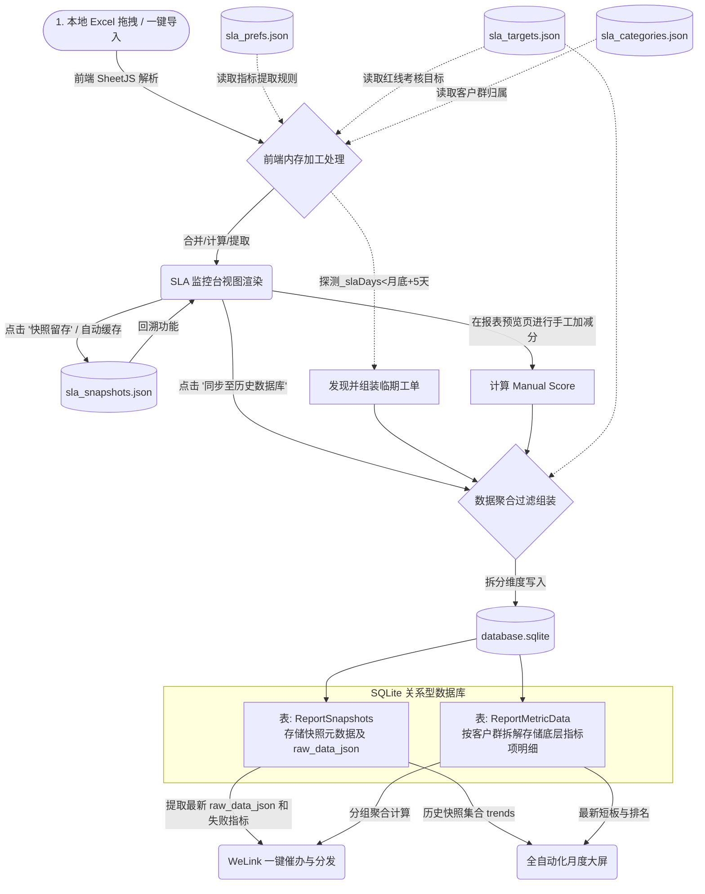

# Tools Platform — 工具中台

> 统一工具平台，前后端分离架构，数据服务端持久化（JSON + SQLite）。
> 目前集成四大核心工具模块：**UIVF12 抓取引擎**、**Task SLA 监控台**、**专业报表入库看板**、**一键催办与自动化月报系统**。

---

## 目录结构

```
tools-platform/
├── README.md
│
├── backend/                        # Node.js 后端服务
│   ├── server.js                   # 主服务入口（Express，端口 3030）
│   ├── package.json                # 依赖声明
│   ├── ecosystem.config.js         # PM2 进程守护配置
│   │
│   ├── routes/                     # API 路由层
│   │   ├── auth.js                 # 认证 & 用户管理路由
│   │   ├── sla.js                  # Task SLA 监控台 API
│   │   ├── uiv.js                  # UIVF12 脚本仓库 API
│   │   ├── upload.js               # 文件上传历史 API
│   │   └── db.js                   # SQLite 历史数据库读取 API
│   │
│   ├── middleware/
│   │   └── auth.js                 # JWT-like Token 鉴权中间件
│   │
│   ├── models/
│   │   ├── store.js                # 通用 JSON 文件读写工具
│   │   └── db.js                   # SQLite3 数据库初始化与操作封装
│   │
│   ├── data/                       # 持久化数据存储
│   │   ├── database.sqlite         # 核心关系型数据库（存储快照与入库明细）
│   │   ├── users.json              # 用户账号 & 密码哈希
│   │   ├── sessions.json           # 登录 Token 会话
│   │   ├── sla_targets.json        # SLA 预警目标（分月配置）
│   │   ├── sla_prefs.json          # SLA 用户偏好（列宽/列显示/排序/指标规则）
│   │   ├── sla_snapshots.json      # SLA 临时导入快照缓存
│   │   ├── sla_categories.json     # SLA 指标分类标签配置
│   │   ├── sla_groups.json         # SLA 指标分组配置
│   │   ├── uiv_scripts.json        # UIVF12 脚本仓库数据
│   │   ├── uiv_categories.json     # UIVF12 自定义分类
│   │   └── upload_history.json     # 文件上传操作历史
│   │
│   └── logs/                       # PM2 运行日志
│       ├── out.log
│       └── error.log
│
└── frontend/                       # 纯静态前端（HTML + Vanilla JS + CSS）
    ├── index.html                  # 平台主页（工具入口导航）
    │
    ├── pages/                      # 子页面
    │   ├── login.html              # 登录页
    │   ├── sla.html                # Task SLA 监控台页面
    │   ├── uivf12.html             # UIVF12 抓取引擎页面
    │   ├── report.html             # 报表入库看板页面
    │   ├── expedite.html           # WeLink 一键催办分发引擎
    │   └── monthly.html            # 自动化月报大屏页面
    │
    ├── css/                        # 样式文件
    │   ├── shared.css              # 公共样式（Navbar、布局、主题变量）
    │   ├── sla.css                 # SLA 监控台专属样式
    │   └── uivf12.css              # UIVF12 工具专属样式
    │
    └── js/                         # JavaScript 模块
        ├── shared/                 # 全局公共模块
        │   ├── api.js              # 统一 API 封装（自动带 Token 的 fetch）
        │   ├── navbar.js           # 顶部导航栏渲染 & 登出逻辑
        │   └── toast.js            # 全局 Toast 通知组件
        │
        ├── sla/                    # Task SLA 监控台模块（9个子模块）
        │   ├── upload.js           # Excel 解析、表格模式识别、历史快照
        │   ├── section.js          # 区块初始化、数据预处理、DOM 渲染
        │   ├── table.js            # 表格渲染（虚拟列宽、排序、过滤）
        │   ├── events.js           # 工具条事件（列设置、去重提取、指标配置）
        │   ├── metrics.js          # 顶部悬浮指标推送、预警呼吸灯、目标弹窗
        │   ├── prefs.js            # 用户偏好本地/服务端持久化
        │   ├── config.js           # SLA 规则配置（周期、预警阈值等）
        │   ├── history.js          # 操作历史记录面板
        │   └── categories.js       # 指标分类管理
        │
        ├── uivf12/                 # UIVF12 抓取引擎模块（5个子模块）
        │   ├── sidebar.js          # 脚本仓库侧边栏（分类、搜索、拖拽）
        │   ├── workbench.js        # 工作台主控（参数输入、模式切换）
        │   ├── generator.js        # 核心代码生成引擎（宏/F12 脚本）
        │   ├── save.js             # 脚本保存 & 仓库管理
        │   └── copy.js             # 代码复制 & 导出工具
        │
        └── report/                 # 报表与催办大屏模块
            ├── report.js           # 数据校对与一键入库逻辑
            ├── expedite.js         # WeLink 双语分发与文案自动化生成
            └── monthly.js          # 月度大屏渲染（ECharts、高清截图导出）
```

---

## 功能模块详解

### 1. 认证系统（Auth）

基于 Bearer Token 的轻量级鉴权机制，支持角色权限控制。

| 角色 | 权限 |
|------|------|
| `admin`（超级管理员） | 全量 CRUD，含用户管理、数据写入 |
| `readonly`（只读用户） | 仅查看数据，所有 POST/PUT/DELETE 被拒绝 |

**API 端点：**

| 方法 | 路径 | 描述 |
|------|------|------|
| POST | `/api/auth/login` | 登录，返回 Token |
| POST | `/api/auth/logout` | 登出，销毁 Token |
| GET  | `/api/auth/me` | 获取当前登录用户信息 |
| GET  | `/api/auth/users` | 获取用户列表（仅 Admin） |
| POST | `/api/auth/users` | 创建新用户（仅 Admin） |
| DELETE | `/api/auth/users/:username` | 删除用户（仅 Admin） |
| PUT  | `/api/auth/users/:username/password` | 重置密码（仅 Admin） |

- Token 有效期：**7 天**
- 密码使用 **SHA-256 + Salt** 哈希存储
- 默认管理员账号 `admin` 不可删除

---

### 2. UIVF12 抓取引擎（`/uivf12`）

自动化脚本工程中心，生成并管理 UI.Vision 宏代码和 F12 控制台脚本。

**核心功能：**
- **脚本仓库管理**：按分类组织脚本，支持增删改查、拖拽换分类
- **代码生成引擎**：根据参数（CPC、NID、运营商区域）智能生成生产级脚本
- **多模式支持**：UI.Vision 宏模式 / F12 控制台模式
- **批量阵列执行**：支持 NetCare 中国、中东、德国三大区批量生成
- **双月裂变**：自动根据运行时间生成跨月翻页逻辑
- **备份还原**：一键导出/导入全量脚本仓库 JSON

#### 2.1 脚本生成核心逻辑 (Generator Pipeline)
当用户点击“一键生成生产级脚本”时，引擎（`generator.js`）会执行以下精密的组装逻辑：

1. **平台与环境判定**
   - 引擎首先嗅探目标 URL，判定属于 `DATAFAB`（华为数据平台）还是 `NETCARE` 体系。
   - 根据平台自动生成相应的身份认证提取逻辑。例如 DataFab 会提取 Cookie 中的 `XSRF-TOKEN`，NetCare 会提取 `localStorage` 中的 `globalConfig` 并解构出 Token。

2. **Payload 深度解析与挂载点探测**
   - 引擎会遍历用户提供的请求体 (JSON Payload)，进行动态“占位符”替换：
   - **CPC/NID 提取**：若开启自动嗅探且检测到相关字段（如 `cpc`, `nid` 数组），会替换为占位符。
   - **时间裂变**：若开启“当月+上月”双重裂变，会匹配包含 `month`, `year` 或是符合同月规则的 `start_date`/`end_date`，将其转换为 `__MONTH_PLACEHOLDER__` 等运行时变量。
   - **关键标识提取**：深度搜索 `pageId`, `boardId`, `srcTenantId`, 组件 `id`，用于后续请求构建。

3. **阶段零 (Phase 0) 预加载代码生成**
   - 如果命中了前置嗅探，会在最终脚本的最前面插入预请求代码：
   - **DataFab CPC 嗅探**：通过 `pageId` 和 `boardId` 调用 `pageView` 日志接口，利用正则提取所有 `CPC[0-9]+`。
   - **NetCare NID 嗅探**：调用 `op_ex_rectify_check_special_nid` 接口，根据 Product Line 提取所有特定的节点 NID 集合。

4. **主循环与分页提取 (Pagination Loop)**
   - 脚本内会构建 `runConfigs` 数组。若是开启了双月裂变，则会自动配置“当月”和“上月”两个循环分支。
   - 分支内执行 `while (isFetching)` 循环，自动递增 `pageNum` / `pageIndex` / `start` 参数实现连续翻页。
   - 智能适配各种奇葩后端的嵌套格式（通过 `extractRows` 兼容 `data.data`, `data.list`, `data.items` 等）。

5. **v6.5 多源融合引擎与权威大盘处理**
   - 针对 DataFab 返回的合计值（sumData / totalsData）经常零散分布且相互割裂的问题，脚本内置了**多源深度融合**机制，从报文的所有可能节点收集合计对象，按列进行 Merge，并优先保留带有 `formula`（公式源）的单元格。
   - **强制获取汇总数据**：若勾选该项且检测到组件 `id`，不论 getAnswers 是否成功返回合计，脚本都会在拉完明细后，**独立发起**针对 `getValueTableSumData` 接口的请求。发送前会扫描前面报文里的所有 `formulaId` 动态构建 `aggFields`，以确保取到最高优的可信汇总数据。

6. **智能取数算法 (`getSmartValue`)**
   - 面对复杂的单元格对象，脚本在组装 CSV 时，严格遵循以下降级取数策略：
   - **绝对优先**：取 `formula` 字段（解决前端计算强依赖）。
   - **率/比字段**：列名带“率、比、rate、%”的，优先取 `average` 字段，被迫降级才取 `summing`。
   - **常规字段**：优先取 `summing` 字段进行累加，被迫降级才取 `average`。
   - **兜底**：若上述都没有，直接 `JSON.stringify` 整个对象防丢失。

7. **最终组装与输出**
   - 最终把所有的明细行和计算出的【总计】行拼接，打上 UTF-8 BOM（防 Excel 乱码），利用 Blob 对象生成 Blob URL 并触发浏览器自动下载。
   - 这个完整执行闭环被包装成两套格式同步输出：**UI.Vision 宏代码** 和 **纯浏览器 F12 控制台脚本**。

**API 端点：**

| 方法 | 路径 | 描述 |
|------|------|------|
| GET  | `/api/uiv/scripts` | 获取全部脚本 & 分类列表 |
| POST | `/api/uiv/scripts` | 新增或覆盖脚本（支持批量） |
| DELETE | `/api/uiv/scripts/:id` | 删除指定脚本 |
| PATCH | `/api/uiv/scripts/:id/category` | 移动脚本分类（拖拽） |
| POST | `/api/uiv/categories` | 新建自定义分类 |
| DELETE | `/api/uiv/categories/:name` | 删除分类及其脚本 |
| GET  | `/api/uiv/backup` | 导出全量备份 |
| POST | `/api/uiv/backup` | 导入备份（覆盖或融合模式） |

---

### 3. Task SLA 监控台（`/sla`）

全局数据合控大中台，整改/风险/专项三类工单合一管理，提供 SLA 预警和指标推送。

#### 3.1 多模式表格导入

支持通过 Excel (.xlsx) 文件导入，自动识别三种表格模式：

| 模式 | 关键字段 | SLA 计算逻辑 |
|------|---------|------------|
| `rectification`（整改表） | `task_status` | Checking 状态：创建时间 +30 天；整改中：计划结束时间 |
| `risk`（风险表） | `风险状态` / `risk_status` | Risk Confirming +30 天；Risk Open：期望关闭时间 |
| `special`（专项表） | `状态-Status` 等 | 待确认：创建日期 +30 天；处理中：要求完成日期 |
| `other`（自由表） | 无限制 | 无 SLA 计算 |

#### 3.2 预警系统

- 🔴 **紧急**（≤10 天）：红色高亮行
- 🟠 **提醒**（≤30/82 天）：橙色提醒行
- 🔥 **重点关注**：手动标记行
- 顶部悬浮状态栏滚动展示所有指标，异常时触发呼吸灯警告

#### 3.3 顶部悬浮指标推送

在每张表上可配置自定义指标规则，支持三种模式：

| 模式 | 说明 |
|------|------|
| **提取单行数值** | IF 某列(X) 包含内容(Y) → 展示该行列(Z)的值 |
| **统计满足次数** | 筛选 X 列含 Y，统计 Z 列中含关键字 K 的行数 |
| **统计占比** | 满足条件行数 / 总行数，结果以百分比展示 |

> **特殊关键字：** 在 Y 或 K 输入框中输入 `[空]` 匹配空白单元格，`[非空]` 匹配有内容的单元格。

支持主指标 + 子指标（按分类分组）的两级层次结构，可跨表数据源引用。

#### 3.4 分月预警目标

为每个指标配置 1~12 月的目标值，支持两种比较方向（≥ 越大越好 / ≤ 越小越好），实时显示差距。

#### 3.5 表格操作工具

- **列设置**：自由显示/隐藏列，设置持久化到服务端
- **列去重提取**：一键提取指定列所有唯一值并复制到剪贴板
- **搜索过滤**：实时全文搜索当前表数据
- **排序**：点击列头升降序排列
- **导出**：导出当前视图（含过滤结果）为 Excel

#### 3.6 历史快照

每次导入数据自动保存快照（最多保留 50 次），支持快照命名、回溯历史、删除旧快照。

**API 端点：**

| 方法 | 路径 | 描述 |
|------|------|------|
| GET  | `/api/sla/targets` | 获取预警目标配置 |
| PUT  | `/api/sla/targets` | 保存预警目标配置 |
| GET  | `/api/sla/prefs/:schemaHash` | 获取指定表的用户偏好 |
| PUT  | `/api/sla/prefs/:schemaHash` | 保存指定表的用户偏好 |
| GET  | `/api/sla/snapshots` | 获取历史快照列表 |
| POST | `/api/sla/snapshot` | 新增历史快照 |
| PUT  | `/api/sla/snapshots/:id` | 更新快照（重命名等） |
| DELETE | `/api/sla/snapshots/:id` | 删除指定快照 |
| GET  | `/api/sla/categories` | 获取指标分类列表 |
| PUT  | `/api/sla/categories` | 更新指标分类列表 |
| GET  | `/api/sla/groups` | 获取指标分组配置 |
| PUT  | `/api/sla/groups` | 更新指标分组配置 |
| GET  | `/api/sla/config` | 导出全量配置（targets + prefs） |
| POST | `/api/sla/config` | 导入全量配置 |

---

### 4. 自动化报表与分发系统（`/report`, `/expedite`, `/monthly`）

基于 SLA 历史快照构建的全链路数据流转中枢，涵盖“入库、通报、复盘”闭环。

**核心功能：**
- **双重持久化引擎**：一键入库，自动剔除冗余项，将 JSON 复杂格式归档落盘至 `database.sqlite` 关系型数据库，支持长周期趋势查询。
- **动态加减分统筹**：支持 16 种事故/奖励的人工考评加减分干预（包含审计发现违规等）。
- **临期工单极速拦截**：在入库时自动弹窗锁定“本月底+5天”内即将超期的工单，精准分流入重点关注池。
- **WeLink 自动化一键催办**：自动组装中英双语催办文案，区分“群聊通知”、“会议邀请”、“个人单发”，一键复制到剪贴板，彻底解放手工粘贴统计的时间。
- **全景月度大屏**：
  - 基于 ECharts 的多维度动态历史曲线图。
  - 短板透视矩阵图、基准得分与评级系统。
  - **优雅无痕导出**：支持底层无截断长图 (Image) 与自适应长卷轴无损 PDF 导出，适用于企业级高层汇报。

---

## 全链路数据流走向图 (Data Flow)

整个工具平台采用 **配置与大容量数据分离** 的双底座架构（`JSON` + `SQLite`），下面梳理了核心业务从“文件导入”到“月报生成”的全生命周期数据走向：



### 数据流转步骤详解

1. **第 1 步：解析与规则注入 (前端 -> 内存)**
   - 当用户在 `SLA 监控台`点击**一键导入**时，浏览器端通过 SheetJS 将数十 MB 的 Excel 直接转为 JSON。
   - 此时，系统会调用配置类文件（`sla_prefs.json` 规则、`sla_targets.json` 目标、`sla_categories.json` 群组），在内存中动态算出哪些指标达标、哪些未达标。
   
2. **第 2 步：临时快照存留 (内存 -> JSON)**
   - 当前的内存快照会被原样压缩，追加写入 `data/sla_snapshots.json`（仅保留最近 50 次，防止文件过大爆炸），主要用于在监控台的**历史回溯**下拉框中快速切换查看原表。

3. **第 3 步：一键统一入库 (内存 -> SQLite)**
   - 当用户进入报表预览界面，完成**“人工加减分操作”**后，点击**同步至数据库**按钮。
   - 系统会做两件事：
     - **拦截告警**：弹窗让用户勾选“本月即将超期”的拦截单（通过 `_slaDays` 识别）。
     - **轻量化归档**：剥离庞大无用的底层表格数据，仅将“考核项数值”、“是否达标标识”、“人工加减分”、“临期单数组”打包进 `raw_data_json`。
   - 最终请求 `POST /api/db/save_dashboard`，数据被拆分写入 `database.sqlite` 中的 `ReportSnapshots`（主表）和 `ReportMetricData`（指标明细从表）中，实现永久留存。

4. **第 4 步：全自动数据消费 (SQLite -> 页面引擎)**
   - **一键催办页 (`expedite.js`)**：直接请求 SQLite 中时间戳最新的快照。不仅提取 `ReportMetricData` 里的不达标项分配给各客户群负责人，还会从 `raw_data_json` 中解包出**临期工单预警**，组装成英文版 WeLink 发送脚本。
   - **月度大屏 (`monthly.js`)**：请求 SQLite 中所有的历史快照数据计算出 `trends` 渲染趋势图；然后取最新快照数据绘制矩阵透视图、加减分明细表以及高亮显示临期风险。

---

## 技术栈

| 层次 | 技术 |
|------|------|
| 后端运行时 | Node.js |
| 后端框架 | Express 4.x |
| 持久化引擎 | SQLite3（历史长线数据）+ JSON文件（配置策略） |
| 进程守护 | PM2 |
| 前端框架 | 纯 HTML + Vanilla JS（无框架依赖） |
| 可视化图表 | ECharts |
| 高清导出 | html2canvas + jsPDF |
| 样式 | Vanilla CSS（自定义设计系统） |
| Excel 解析 | SheetJS (xlsx) |
| 唯一 ID | uuid v9 |
| 文件上传 | multer |

---

## 快速启动

### 开发模式

```bash
cd backend
npm install
npm run dev    # 使用 nodemon 自动重启，端口 3030
```

### 生产模式（PM2）

```bash
cd backend
npm install --omit=dev

# 启动
pm2 start ecosystem.config.js

# 查看状态
pm2 status tools-platform

# 查看日志
pm2 logs tools-platform

# 停止
pm2 stop tools-platform

# 重启
pm2 restart tools-platform
```

启动后访问：
- 平台主页：`http://localhost:3030`
- UIVF12：`http://localhost:3030/uivf12`
- SLA 监控台：`http://localhost:3030/sla`
- 报表看板：`http://localhost:3030/report`
- 健康检查：`http://localhost:3030/api/health`

---

## 数据存储与备份说明

项目采用 **JSON（业务配置）+ SQLite（核心报表数据）** 双轨制持久化策略，所有数据文件均统一集中在 `backend/data/` 目录下。您无需额外部署 MySQL 等重型数据库，直接打包该目录即可实现全量备份与迁移。

### 1. SQLite 关系型数据库 (核心报表与流转数据)

**文件位置：** `backend/data/database.sqlite`

这是整个架构的数据计算中枢，存储所有经剥离过滤后的“入库数据”。它包含以下两张核心业务表：

- **表名：`ReportSnapshots`（快照主表）**
  - **用途**：记录每次“一键入库”的宏观元数据（如所属月份、创建时间、入库截图路径等）。
  - **关键字段 (`raw_data_json`)**：用于存放高度结构化的非关系型数据，例如**手工加减分配置**以及探测到的**临期/超期告警工单数组**（WeLink 催办模块的核心数据源）。

- **表名：`ReportMetricData`（指标明细从表）**
  - **用途**：将每次快照下被拆解的最细粒度指标横向展开存储。
  - **内容**：包含了某个“客户群”针对某个“考核指标”的具体实测值、目标值、计分权重、以及最核心的 `is_failing`（是否达标标识）。
  - **场景**：用于月报大屏短板透视矩阵的实时 SQL 聚合计算，以及“一键催办”按需提取不达标项。

### 2. JSON 扁平化存储 (业务策略与配置字典)

文件统一位于 `backend/data/` 目录下，直接修改或替换即可生效，属于高频备份的核心资产。

| 配置文件名称 | 具体用途与作用解析 | 建议备份 |
|-------------|------------------|---------|
| `users.json` | 存储平台各级账号信息、角色（Admin/Readonly）及 SHA-256 加密的密码哈希。 | ✅ 是 |
| `sla_targets.json` | SLA 监控台的核心业务目标库。存储所有考核指标 1~12 月的动态红线目标值、计分方向（≥ 或 ≤）及奖惩权重。 | ✅ 是 |
| `sla_prefs.json` | 极为关键！存储了 **SLA 指标提取规则引擎** 的底层逻辑结构，以及用户在前端拖拽列、过滤排序等个性化显示偏好。 | ✅ 是 |
| `sla_snapshots.json` | 导入缓存库。仅用于前端用户点击“历史回溯”时快速恢复前几次拉取表格时的原始视图，最多保留 50 个大文件，**不参与月报正式计算**。 | ✅ 是 |
| `sla_categories.json` | 客户群字典库。存储客户群的长名称、缩写等分类标签。 | ✅ 是 |
| `sla_groups.json` | 排版映射库。控制专业报表在渲染矩阵时，各个单一指标到底该被分到哪一个“领域组”下。 | ✅ 是 |
| `uiv_scripts.json` | UIVF12 抓取引擎的代码仓库。你的全部心血：包含分类、自定义宏参数映射、底层控制台注入 JS 代码均在此。 | ✅ 是 |
| `uiv_categories.json` | UIVF12 脚本系统的自定义树状目录分类结构。 | ✅ 是 |
| `upload_history.json` | 全平台的文件上传日志及物理文件映射记录。 | ❌ 否 |
| `sessions.json` | 用户登录状态 Token 会话缓存，Node.js 重启后自动续命。 | ❌ 否 |

---

## 权限说明

前端所有写操作（新增、修改、删除）会在请求前检查用户角色，只读用户访问时相关按钮会被隐藏或禁用。后端 API 对所有非 GET 请求强制校验 `admin` 角色，双重保障。
