# Tools Platform 项目说明

Tools Platform 是一个面向日常运维、数据导入、指标看板、月报分析、PR 审计和自定义工具集成的本地/内网 Web 工具中台。项目采用 Express + 静态前端页面架构，后端提供鉴权、SQLite/JSON 持久化、AI 助手、全局设置、备份恢复和各业务模块 API。

## 快速启动

项目根目录为 `tools-platform`。如果你当前在上一级目录（例如 `privacy-policy` 或解压后的 `privacy-policy-main`），请先执行：

```bash
cd tools-platform
```

推荐环境：

- Node.js 20 LTS
- npm 9+
- Windows 用户如遇 `sqlite3/node-gyp` 安装问题，建议安装 Visual Studio Build Tools 2022，并勾选 `Desktop development with C++`

华为内网环境如 `npm install` 下载慢或失败，可先配置华为 npm 源：

```bash
npm config rm proxy
npm config rm http-proxy
npm config rm https-proxy
npm config set no-proxy .huawei.com
npm config set registry http://cmc-cd-mirror.rnd.huawei.com/npm
```

```bash
cd backend
npm install
npm run doctor
npm start
```

开发模式（nodemon 自动重启）：

```bash
cd backend
npm install
npm run dev
```

默认端口为 `3030`，可通过环境变量 `PORT` 覆盖。

```bash
PORT=3030 npm start
```

Windows PowerShell 示例：

```powershell
$env:PORT=3030
npm start
```

## 桌面版打包与自动更新

桌面版使用 Electron + electron-builder。Windows 安装包为 NSIS 安装版，支持选择安装目录；安装后的客户端可在“全局设置 -> 程序更新”中检查、下载并重启安装新版本。

发布新版时直接把代码推送到 `main`。GitHub Actions 会自动递增 `tools-platform/package.json` 的 patch 版本、提交版本号、创建 `vX.Y.Z` tag，并发布安装包：

```bash
git add .
git commit -m "feat: update desktop app"
git push origin main
```

也可以手动推送 `v*` tag 触发指定版本发布，但日常建议使用上面的自动发布流程。

GitHub Actions 会在 Windows/macOS runner 上打包，并把安装包、`latest.yml`、`latest-mac.yml` 和 `.blockmap` 发布到 GitHub Releases。Windows 客户端检查更新依赖 Release 中的 `latest.yml`，因此不要手动删除该文件。

本地只验证打包配置时可运行：

```bash
cd tools-platform
npm run build:win
```

如果在 macOS 上交叉打包 Windows 版本遇到 `sqlite3` 原生依赖错误，优先以 GitHub Actions 的 Windows runner 产物为准。

生产模式（PM2，推荐）：

```bash
cd backend
pm2 start ecosystem.config.js
pm2 save
pm2 startup
```

PM2 配置说明（`backend/ecosystem.config.js`）：

- 进程名：`tools-platform`
- 最大内存自动重启：256MB
- PM2 兼容日志路径：`backend/logs/out.log`、`backend/logs/error.log`
- 应用每日归档日志：`backend/logs/YYYY-MM-DD/out.log`、`backend/logs/YYYY-MM-DD/error.log`
- 生产环境变量：`NODE_ENV=production`，`PORT=3030`

`npm start` 会自动执行启动自检，检查 Node 版本、依赖包、SQLite 原生包、必要目录权限等。也可以单独运行：

```bash
npm run doctor
```

如果提示 `sqlite3` 未就绪，优先尝试：

```bash
npm rebuild sqlite3
```

常用入口：

- `/login.html`：登录页
- `/`：工具中台首页
- `/uivf12`：数据抓取 / UIVF12 脚本仓库
- `/sla`：全局数据合控大中台 / 数据导入
- `/report`：报表看板
- `/expedite`：一键催办
- `/monthly`：月报页面
- `/praudit`：PR 稽查 / PR 审计
- `/requirements`：需求广场
- `/frt`：FRT KPI 自动化核算平台
- `/storage`：存储迁移状态台
- `/db-explorer`：数据探索
- `/tools/:slug`：自定义工具入口

## 技术架构

前端：

- 多页面静态 HTML + 原生 JavaScript。
- 入口首页为 `frontend/index.html`，各业务页面位于 `frontend/pages/`。
- 公共组件位于 `frontend/js/shared`，包括顶部导航、API 封装、Toast、AI 助手、离线审计运行时等。
- 业务脚本按模块拆分在 `frontend/js/sla`、`frontend/js/report`、`frontend/js/uivf12` 等目录。

后端：

- `backend/server.js` 是 Express 主入口。
- API 路由位于 `backend/routes`。
- 持久化模型位于 `backend/models`。
- 请求中间件位于 `backend/middleware`（鉴权等）。
- 静态页面由 Express 直接 serve `frontend/` 目录。

主要依赖：

- `express`：HTTP 服务
- `sqlite3`：SQLite 数据库
- `multer`：上传备份包
- `exceljs`：Excel 生成
- `@google/generative-ai`：Gemini AI 助手

## 环境变量

在 `backend/` 目录下创建 `.env` 文件或直接通过系统环境变量注入：

```env
# 服务端口，默认 3030
PORT=3030

# Node 环境，生产环境设为 production
NODE_ENV=production

# Gemini AI Key（可选，也可在全局设置页面配置）
# Key 通常以 AIza 开头
GEMINI_API_KEY=AIza...
```

若在全局设置页面配置了 Gemini API Key，则会优先使用数据库中的配置；未配置时才读取环境变量 `GEMINI_API_KEY` 作为兜底。

## 中间件

`backend/middleware/` 目录下的中间件：

- `auth.js`：统一鉴权中间件，检查 session 登录状态。除 `/api/auth/login`、静态文件等白名单路由外，所有 `/api/*` 请求需通过此中间件验证。非 GET 的修改类请求默认还需要管理员权限。

## 鉴权与账号

账号登录由 `/api/auth` 提供：

- `POST /api/auth/login`：登录
- `POST /api/auth/logout`：退出
- `GET /api/auth/me`：当前用户
- `GET /api/auth/users`：用户列表，管理员权限
- `POST /api/auth/users`：新增用户，管理员权限
- `DELETE /api/auth/users/:username`：删除用户，管理员权限
- `PUT /api/auth/users/:username/password`：修改密码，管理员权限

除登录接口外，大部分 `/api/*` 请求需要登录。非 GET 修改类请求默认需要管理员权限，部分业务路由内部还有额外校验。

## 顶部导航与全局设置

顶部导航由 `frontend/js/shared/navbar.js` 渲染，并从 `/api/nav-settings` 读取配置。

主要能力：

- 顶部菜单显示/隐藏和排序。
- 更多工具折叠。
- 自定义工具分类和排序。
- 全局设置齿轮入口。
- 账号管理入口已整合进全局设置。
- 页面级配置预留菜单，便于后续把各页面设置迁移到全局设置。
- 报表看板配置中包含历史快照冗余清理功能。
- AI 助手模型配置入口。
- 全局数据库备份与恢复入口。

## 智能客服助手

智能客服助手由前端 `frontend/js/shared/ai-assistant.js` 和后端 `/api/ai/chat` 组成。

工作原理：

1. 前端在页面右下角注入悬浮 AI 按钮。
2. 打开助手后，前端调用 `getPageContext()` 获取当前页面上下文。
3. 上下文优先读取 `.page-content` 的 `innerText`。
4. 如果页面没有 `.page-content`，则退化读取 `document.body.innerText`。
5. 前端把 `messages`、`context`、`pageTitle` 发给 `/api/ai/chat`。
6. 后端把页面标题、页面文本上下文和对话历史组合成 system instruction + chat history，再调用 Gemini。
7. 返回回答时会显示本次 token 和估算费用。

重要限制：

- 助手不会自动读取整个数据库。
- 助手不会自动知道所有历史快照、所有表格、所有自定义工具内部数据。
- 大表格不会被专门结构化压缩后传给 AI，除非页面文本本身已经渲染出相关内容。
- 自定义工具默认只对“页面可见文本”有帮助；如果自定义工具需要更强 AI 能力，后续应增加标准的“AI 上下文导出函数/接口”。
- 后端会把页面上下文截断到约 15000 字符，避免 token 过大。

AI 配置：

- 全局设置中可配置 Gemini API Key、模型名、temperature、max output tokens、费用估算参数和系统补充提示词。
- 若未在设置中配置 API Key，后端会尝试使用环境变量 `GEMINI_API_KEY` 作为兜底。
- 当前后端会校验 Key 格式，Gemini Key 通常以 `AIza` 开头。
- 对 503/high demand 等临时错误有自动重试。

## 数据存储说明

项目处于从 JSON 文件存储逐步迁移到 SQLite 的阶段。现在不是所有模块都完全单一存储形态，需要区分两类 JSON：

- JSON 文件存储：例如 `backend/data/*.json`，是历史存储方式或部分模块当前仍使用的轻量配置。
- SQLite 表中的 JSON 字段：例如 `data/report.db` 的 `ReportSnapshots.raw_data_json`，它存放在数据库里，只是字段内容是 JSON 字符串，用于保存完整快照结构和兼容历史展示。

主要数据位置：

- `backend/data/tools.db`：多数迁移后的业务数据和设置，包括 UIV 脚本、SLA 目标/偏好/快照、账号等。
- `data/report.db`：报表看板入库数据、月报趋势、快照、客户群得分、指标明细。
- `data/requirements.db`：需求广场。
- `backend/data/*.json`：部分历史数据、配置兜底和仍未完全迁移的模块数据。
- `data/images`：报表截图和 Excel 导出文件。
- `backend/backups`：全局备份包。

## 项目数据流总览

下面的 Mermaid 图把主要页面、API、SQLite 表、JSON 兜底文件和备份链路串在一起，便于快速理解数据从哪里进入、写到哪里、又被哪些页面消费。

```mermaid
flowchart LR
    User["用户 / 浏览器"] --> Navbar["顶部导航 + 全局设置"]
    User --> UIVPage["数据抓取 / UIVF12"]
    User --> SLAPage["数据导入 / SLA 合控"]
    User --> ReportPage["报表看板"]
    User --> ExpeditePage["一键催办"]
    User --> MonthlyPage["月报页面"]
    User --> PRAuditPage["PR 稽查"]
    User --> FRTPage["FRT 核算"]
    User --> ReqPage["需求广场"]
    User --> CustomToolPage["自定义工具"]
    User --> DBExplorer["数据探索"]
    User --> AIAssistant["智能客服助手"]

    subgraph Frontend["前端页面层"]
        Navbar
        UIVPage
        SLAPage
        ReportPage
        ExpeditePage
        MonthlyPage
        PRAuditPage
        FRTPage
        ReqPage
        CustomToolPage
        DBExplorer
        AIAssistant
    end

    subgraph API["Express API 层"]
        AuthAPI["/api/auth"]
        NavAPI["/api/nav-settings"]
        AISettingsAPI["/api/ai-settings"]
        AIAPI["/api/ai/chat"]
        UIVAPI["/api/uiv"]
        SLAAPI["/api/sla + /api/upload"]
        ReportAPI["/api/db"]
        PRAuditAPI["/api/praudit"]
        FRTAPI["/api/frt"]
        ReqAPI["/api/requirements"]
        CustomToolAPI["/api/custom-tools"]
        BackupAPI["/api/global-backup"]
        ExplorerAPI["/api/db-explorer"]
        StorageAPI["/api/storage"]
    end

    Navbar --> NavAPI
    Navbar --> AuthAPI
    Navbar --> AISettingsAPI
    Navbar --> BackupAPI
    AIAssistant --> AIAPI
    UIVPage --> UIVAPI
    SLAPage --> SLAAPI
    ReportPage --> ReportAPI
    ReportPage --> SLAAPI
    ExpeditePage --> ReportAPI
    MonthlyPage --> ReportAPI
    PRAuditPage --> PRAuditAPI
    FRTPage --> FRTAPI
    ReqPage --> ReqAPI
    CustomToolPage --> CustomToolAPI
    DBExplorer --> ExplorerAPI
    StorageAPI --> ToolsDB

    subgraph ToolsDB["backend/data/tools.db"]
        auth_users["auth_users"]
        auth_sessions["auth_sessions"]
        uiv_scripts["uiv_scripts"]
        uiv_categories["uiv_categories"]
        upload_history["upload_history"]
        sla_categories["sla_categories"]
        sla_targets["sla_targets"]
        sla_prefs["sla_prefs"]
        sys_dictionaries["sys_dictionaries"]
        sla_groups["sla_groups"]
        sla_group_items["sla_group_items"]
        sla_snapshots["sla_snapshots"]
        frt_snapshots["frt_snapshots"]
        praudit_configs["praudit_configs"]
    end

    subgraph ReportDB["data/report.db"]
        ReportSnapshots["ReportSnapshots"]
        ReportCategoryScores["ReportCategoryScores"]
        ReportMetricData["ReportMetricData"]
        PlatformConfig["PlatformConfig"]
    end

    subgraph RequirementDB["data/requirements.db"]
        Requirements["Requirements"]
        RequirementLogs["RequirementLogs"]
    end

    subgraph JsonFallback["backend/data/*.json 历史/兜底数据"]
        users_json["users.json"]
        sessions_json["sessions.json"]
        uiv_scripts_json["uiv_scripts.json"]
        uiv_categories_json["uiv_categories.json"]
        upload_history_json["upload_history.json"]
        sla_json["sla_categories / sla_targets / sla_prefs / sla_groups / sla_snapshots.json"]
        frt_json["frt_snapshots.json"]
        nav_json["nav_settings.json"]
        ai_json["ai_settings.json"]
        custom_tools_json["custom_tools.json"]
    end

    subgraph Files["文件和运行态目录"]
        Images["data/images 截图和 Excel"]
        Outputs["outputs 导出产物"]
        CustomHTML["backend/data/custom-tools HTML"]
        Backups["backend/backups 全局备份包"]
        Runtime["backend/runtime 远端同步本机配置"]
    end

    AuthAPI --> auth_users
    AuthAPI --> auth_sessions
    AuthAPI -. "旧数据迁移/兜底" .-> users_json
    AuthAPI -. "旧数据迁移/兜底" .-> sessions_json

    NavAPI --> nav_json
    AISettingsAPI --> ai_json
    AIAPI --> AIProvider["Gemini API"]

    UIVAPI --> uiv_scripts
    UIVAPI --> uiv_categories
    UIVAPI -. "JSON 强制源/迁移兜底" .-> uiv_scripts_json
    UIVAPI -. "JSON 强制源/迁移兜底" .-> uiv_categories_json

    SLAAPI --> upload_history
    SLAAPI --> sla_categories
    SLAAPI --> sla_targets
    SLAAPI --> sla_prefs
    SLAAPI --> sys_dictionaries
    SLAAPI --> sla_groups
    SLAAPI --> sla_group_items
    SLAAPI --> sla_snapshots
    SLAAPI -. "JSON 强制源/迁移兜底" .-> upload_history_json
    SLAAPI -. "JSON 强制源/迁移兜底" .-> sla_json

    ReportAPI --> ReportSnapshots
    ReportAPI --> ReportCategoryScores
    ReportAPI --> ReportMetricData
    ReportAPI --> PlatformConfig
    ReportAPI --> Images
    ReportSnapshots --> ExpeditePage
    ReportSnapshots --> MonthlyPage
    ReportCategoryScores --> MonthlyPage
    ReportMetricData --> MonthlyPage

    PRAuditAPI --> praudit_configs
    PRAuditPage --> Outputs
    PRAuditPage --> CustomHTML

    FRTAPI --> frt_snapshots
    FRTAPI -. "JSON 强制源/迁移兜底" .-> frt_json

    ReqAPI --> Requirements
    ReqAPI --> RequirementLogs

    CustomToolAPI --> custom_tools_json
    CustomToolAPI --> CustomHTML
    CustomToolPage --> CustomHTML

    ExplorerAPI --> ToolsDB
    ExplorerAPI --> ReportDB
    ExplorerAPI --> RequirementDB

    BackupAPI --> Backups
    BackupAPI --> ToolsDB
    BackupAPI --> ReportDB
    BackupAPI --> RequirementDB
    BackupAPI --> JsonFallback
    BackupAPI --> Images
    BackupAPI --> CustomHTML
    BackupAPI --> RemoteMain["远端主站备份 API"]
    RemoteMain --> Backups
    Runtime --> BackupAPI
```



主要数据表和文件说明：

| 存储位置 | 表 / 文件 | 主要来源 | 主要消费方 |
| --- | --- | --- | --- |
| `backend/data/tools.db` | `auth_users`, `auth_sessions` | 登录、账号管理 | 全部受保护 API |
| `backend/data/tools.db` | `uiv_scripts`, `uiv_categories` | 数据抓取 / UIVF12 | UIVF12 侧边栏、脚本仓库 |
| `backend/data/tools.db` | `upload_history` | 数据导入、脚本/工具等操作日志 | 首页最近操作历史、数据导入日志 |
| `backend/data/tools.db` | `sla_categories`, `sla_targets`, `sla_prefs`, `sys_dictionaries` | SLA 配置、目标月份、列偏好 | 数据导入、报表看板、月报 |
| `backend/data/tools.db` | `sla_groups`, `sla_group_items` | 指标分组配置 | 报表看板、月报、催办 |
| `backend/data/tools.db` | `sla_snapshots` | 风险/整改/CPT/SR/漏洞 CSV 导入快照 | 报表看板临期识别、入库前提醒 |
| `backend/data/tools.db` | `frt_snapshots` | FRT 页面导入与核算 | FRT 核算页面 |
| `backend/data/tools.db` | `praudit_configs` | PR 审计模板配置 | PR 稽查页面、PDF/快照导出 |
| `data/report.db` | `ReportSnapshots` | 报表看板点击入库 | 报表看板历史快照、一键催办、月报 |
| `data/report.db` | `ReportCategoryScores` | 报表看板入库计算结果 | 月报客户群排名、趋势、评分 |
| `data/report.db` | `ReportMetricData` | 报表看板入库指标明细 | 月报矩阵、短板分析、比例计分展示 |
| `data/report.db` | `PlatformConfig` | 报表看板配置写入 | 报表页面配置、自动填报偏好 |
| `data/requirements.db` | `Requirements`, `RequirementLogs` | 需求广场 | 需求广场列表、状态流转日志 |
| `backend/data/*.json` | `*_json` 历史配置和数据 | 旧版本存储、强制 JSON 源、迁移兜底 | 存储迁移状态台、兼容读取 |
| `data/images` | PNG/XLSX 导出文件 | 报表看板截图、Excel 下载 | 报表页面、月报/导出 |
| `backend/data/custom-tools` | 自定义 HTML 文件 | 自定义工具导入 | `/tools/:slug` 动态工具入口 |
| `backend/backups` | 全局备份 zip | 手动备份、恢复前安全备份、远端同步触发备份 | 全局设置备份恢复、分站同步 |
| `backend/runtime` | 远端同步本机配置和状态 | 全局设置远端主站同步 | 启动自动拉取备份，不参与全局备份 |

## 数据抓取 / UIVF12 脚本仓库

入口：`/uivf12`

用途：

- 管理 UIVF12 脚本仓库。
- 生成、保存、分类、移动和删除脚本。
- 支持侧边栏脚本仓库。
- 支持脚本分类。
- 支持普通上传失败后的 gzip 压缩兜底上传。
- 前端保存链路有详细控制台日志，便于定位 403、请求体过大、重名冲突等问题。

相关 API：

- `GET /api/uiv/scripts`
- `POST /api/uiv/scripts`
- `DELETE /api/uiv/scripts/:id`
- `PATCH /api/uiv/scripts/:id/category`
- `POST /api/uiv/categories`
- `DELETE /api/uiv/categories/:name`
- `GET /api/uiv/backup`
- `POST /api/uiv/backup`

## 数据导入 / SLA 合控大中台

入口：`/sla`

用途：

- 导入风险、整改、专项风险、SR 等数据表。
- 基于不同表前缀识别数据类型。
- 分析临期、超期和风险项。
- 支持目标月份切换。
- 支持强制选择数据读取来源。
- 支持来源标识直接渲染，便于确认来自 JSON 还是 SQLite。
- 支持上传历史、表格偏好、字段宽度、排序、显示列、指标规则。
- 支持快照保存、快照压缩上传和历史快照读取。
- 支持清理历史冗余快照，保留每天最新快照。

已支持的数据类型示例：

- 整改表：`PBI_自动抓取-整改详单_整改_Latest`
- 常规风险表：`PBI_自动抓取-风险详单_Latest`
- 专项风险表：`PBI_自动抓取-CPT风险详表_Latest`
- SR 详单：`PBI_自动抓取-详单-SR_Latest`
- 漏洞预警详单：`PBI_自动抓取-详单漏洞_漏洞预警_Latest`

SR 分析重点：

- `sr_status_name`：工单状态
- `open_date`：开单时间
- `exp_close_date`：期望关闭时间
- `act_close_date`：实际关闭时间
- `hw_sev_name / urgency`：严重级别/紧急度
- `overdue`：上游超期标识
- 挂起单可忽略，因为上游会顺延期望关闭时间。

漏洞预警分析重点：

- `task_status`：当前处理状态。
- `create_time`：建单时间。
- 状态为 `Checking`、`Communication Dept`、`Communication Customer` 时进入 30 天完成预警。
- 截止时间按 `create_time + 30天` 计算，剩余 10 天内红色高危，30 天内黄色提醒。

相关 API：

- `GET /api/sla/categories`
- `PUT /api/sla/categories`
- `GET /api/sla/groups`
- `PUT /api/sla/groups`
- `GET /api/sla/targets`
- `PUT /api/sla/targets`
- `GET /api/sla/snapshots`
- `POST /api/sla/snapshot`
- `PUT /api/sla/snapshots/:id`
- `DELETE /api/sla/snapshots/:id`
- `POST /api/sla/snapshots/cleanup-redundant`
- `GET /api/sla/prefs/:schemaHash`
- `PUT /api/sla/prefs/:schemaHash`
- `POST /api/sla/rename-metric`

## 报表看板

入口：`/report`

用途：

- 从 SLA 快照生成客户群 KPI 看板。
- 支持目标月份切换。
- 支持按客户群、指标、分组生成“赛马排行”。
- 支持手动填报指标。
- 支持指标分组配置、权重配置、目标配置。
- 支持手动加减分项目。
- 支持发现临期待处理数据后统一入库。
- 支持导出 Excel。
- 支持点击“入库”把快照、客户群得分、指标明细写入 `data/report.db`。

短板透视矩阵：

- 展示全局总体达标、各客户群指标值、各客户群得分。
- 支持指标分组。
- 支持表头筛选。
- 支持单指标比例计分开关。

比例计分规则：

- 默认关闭。
- 用户可在单个指标旁开启。
- 开启后，未达标客户群不再直接得 0 分，而是按完成目标比例折算。
- `≥目标` 类指标按 `实际值 / 目标值` 折算。
- `≤目标` 类指标按 `目标值 / 实际值` 折算。
- 折算得分不超过该指标权重。
- 开关持久保存到该指标目标配置。

入库表结构：

- `ReportSnapshots`：快照主表，保存快照 ID、目标月份、创建时间、标准总分、原始快照 JSON、图片/Excel 路径。
- `ReportCategoryScores`：客户群得分表，保存基准得分、手工调整、最终得分。
- `ReportMetricData`：指标明细表，保存客户群、指标、权重、目标、原始值、是否未达标、差距、实得分、比例计分状态、完成率。
- `PlatformConfig`：报表相关配置。

## 一键催办

入口：`/expedite`

用途：

- 基于报表入库结果和 SLA 临期任务生成催办内容。
- 支持中文/英文提醒内容。
- 支持从报表看板入库后的数据生成简报。
- 支持下载 Excel 表格。
- 支持各客户群得分、扣分项和临期任务汇总。

数据来源：

- 主要来自 `data/report.db` 的报表入库结果。
- 模板、忽略规则和部分配置来自 SLA 配置链路。

## 月报页面

入口：`/monthly`

用途：

- 展示月度运营质量与合规分析报告。
- 支持目标月份切换。
- 支持时间范围筛选：最近 7 天、30 天、90 天、全部、自定义日期。
- 支持趋势图、客户群排名、短板矩阵、完整快照矩阵、手动加减分明细。
- 支持中英文切换。
- 支持导出长图和 PDF。

数据来源：

- 月报趋势、客户群分数、指标明细主要来自 `data/report.db`。
- 完整快照结构会使用 `ReportSnapshots.raw_data_json` 作为结构补充。
- 对已经入库的指标得分，优先使用 `ReportMetricData.earned_score`、`proportional_scoring` 和 `completion_ratio`。
- `raw_data_json` 是 SQLite 表字段中的 JSON 字符串，不是旧 JSON 文件存储。

设计原则：

- 历史月报应尽量展示入库时的结果，避免用当前前端逻辑重新计算导致口径漂移。
- `raw_data_json` 主要用于保留完整快照结构、兼容旧数据和补充展示。

## PR 稽查 / PR 审计

入口：`/praudit`

用途：

- 导入 Excel 进行 PR 审计。
- 支持自定义审计模板。
- 支持模板字段、主键字段、检查点、检查点排序。
- 支持分组字段，例如客户群、产品线等。
- 支持导入过滤条件，可以按一列或多列筛选审计对象。
- 支持导入后抽查提示和快捷抽查数量。
- 如果模板配置了分组字段，抽查会尽量在各分组均匀抽取。
- 支持批量导入多个 Excel。
- 支持每个检查点单独配置不通过理由模板。
- 点击不通过后可填写原因、选择理由模板、粘贴或上传截图证据。
- 页面表头和分组支持吸顶，便于大表审计。
- 支持导出 PDF、双语 PDF、按分组导出 PDF。
- 支持导出/导入审计快照包。
- 支持按分组导出离线审计工作包。

离线审计包：

- 导出快照包时可附带离线 HTML 页面。
- 离线 HTML 会引导责任人导入快照包继续审计。
- 责任人审计完成后可再导出快照包交回管理人员。
- 按分组导出的快照包会为每个分组生成独立工作包和模板名，降低本地缓存串包风险。
- 离线包会阉割部分管理功能，例如自定义新模板、编辑模板、删除模板、测试数据、按分组导出等。

相关 API：

- `GET /api/praudit/configs`
- `POST /api/praudit/configs`
- `DELETE /api/praudit/configs/:id`

## FRT KPI 自动化核算平台

入口：`/frt`

用途：

- 导入 FRT 报表。
- 按考核月份计算 FRD、FRC 和最终 FRT。
- 支持 SR 类型动态筛选，默认勾选 `CS - Technical Request`。
- 支持自定义显示列。
- 支持 KPI 杀手点名录，按客户分组列出导致扣分的单据。
- 支持点击单据查看完整行详情。
- 支持保存历史快照和查看历史快照。

计算口径：

- `FRD`：本月任务总基数，符合所选 SR 类型和过滤规则的合规工单。
- `FRC`：本月按时完成数，在期望关闭时间前完成闭环。
- `FRT`：`FRC ÷ FRD × 100%`。

目标分与分数试算栏：

- 目标分默认 `98.5%`，可手动调整并持久记忆。
- 试算分子 FRC 和分母 FRD 默认带入当前真实核算结果。
- 修改试算值后实时判断是否达标。
- 可显示若分母不变还差多少 FRC。
- 可估算通过新增并按时闭环工单稀释扣分项时还需要多少单。
- 试算不会改写真实核算结果。

相关 API：

- `GET /api/frt/snapshots`
- `POST /api/frt/snapshots`
- `DELETE /api/frt/snapshots/:id`

## 需求广场

入口：`/requirements`

用途：

- 提交新需求。
- 按页面分类管理需求。
- 查看需求详情和流转日志。
- 管理需求状态：提交、需求接受、需求实现中、需求完成、验收完成、需求评价、已拒绝。
- 支持需求排序。
- 管理员可修改、流转和删除需求。

数据来源：

- `data/requirements.db`

相关 API：

- `GET /api/requirements`
- `GET /api/requirements/:id`
- `POST /api/requirements`
- `PUT /api/requirements/:id`
- `DELETE /api/requirements/:id`

## 存储迁移状态台

入口：`/storage`

用途：

- 查看 JSON 到 SQLite 的迁移状态。
- 对比各模块 JSON 与 DB 的记录数量、字段概况和差异。
- 帮助判断是否仍有遗漏模块未迁移。
- 辅助确认强制 JSON、强制 SQLite、自动模式下的数据来源。

相关 API：

- `GET /api/storage/status`

## 数据探索

入口：`/db-explorer`

用途：

- 浏览 SQLite 数据库表。
- 查看表结构和表数据。
- 帮助验证新增表、迁移表、报表入库表和需求表。

相关 API：

- `GET /api/db-explorer/tables`
- `GET /api/db-explorer/tables/:name`

## 自定义工具

入口：

- `/tools/:slug`
- `/custom-tools/:slug/index.html`

用途：

- 支持上传独立 HTML 页面作为平台工具。
- 上传后自动生成首页模块入口和顶部导航入口。
- 支持二级分类、排序和折叠。
- 支持删除自定义工具。
- 支持下载已导入的 HTML，方便离线使用或二次编辑。
- 增加/删除工具会写入最近操作历史。

注意：

- 自定义工具路由由后端动态读取工具注册信息，不需要为每个工具手写 Express 路由。
- 上传新工具后通常不需要重启 PM2。
- 自定义工具默认不会把内部结构化数据自动提供给 AI 助手，AI 只能看到页面可见文本。

相关 API：

- `GET /api/custom-tools`
- `POST /api/custom-tools`
- `DELETE /api/custom-tools/:slug`

## 最近操作历史

用途：

- 记录上传、保存、导入、自定义工具增删等关键操作。
- 首页或相关页面可展示最近操作记录。

相关 API：

- `GET /api/upload/history`
- `POST /api/upload/history`
- `DELETE /api/upload/history`

## 全局备份与恢复

入口：全局设置 -> 数据备份与恢复

用途：

- 备份全局配置和业务数据。
- 可在服务器生成备份包。
- 可下载备份包。
- 可从服务器已有备份恢复。
- 可上传备份包恢复。

备份范围：

- `backend/data`
- `data`

备份位置：

- `backend/backups`

跨平台说明：

- 备份与恢复使用 Node.js 内置流程和 `JSZip`，不依赖系统 `/usr/bin/zip` 或 `/usr/bin/unzip`，Windows 可直接使用。

相关 API：

- `GET /api/global-backup/list`
- `POST /api/global-backup/create`
- `GET /api/global-backup/download/:name`
- `POST /api/global-backup/restore/server/:name`
- `POST /api/global-backup/restore/upload`
- `GET /api/global-backup/remote-settings`
- `PUT /api/global-backup/remote-settings`
- `POST /api/global-backup/remote-check`
- `POST /api/global-backup/remote-pull`

远端主站同步：

- 可在“全局设置 -> 备份恢复 -> 远端主站同步”中启用。
- 可填写远端服务器域名、账号、密码。
- 支持检查远端最新备份、按规则拉取恢复、强制恢复远端最新备份。
- 可选择在拉取前请求远端主站立即生成一份新备份，主站备份列表会显示“外部同步触发”标识，文件 reason 形如 `remote-sync-request_by_<username>`。
- 支持启动时自动检查并恢复远端最新全局备份，适合分站或 Windows 本地环境快速同步主站数据。
- 远端同步配置和最近恢复标记保存在 `backend/runtime`，不参与全局备份，避免恢复主站数据后覆盖本机同步配置或造成启动恢复循环。

风险提示：

- 恢复操作会影响全局配置和业务数据。
- 恢复前建议先创建当前状态备份。
- 恢复成功后后端会自动结束当前进程，以释放 SQLite 文件连接并避免继续使用旧缓存；PM2 会自动拉起，手动 `npm start` 场景下请重新启动服务。
- Windows 恢复时如果提示 `EPERM`/`Permission denied`，通常是服务或其他程序正在占用 SQLite 数据文件；请停止当前服务后再恢复，恢复完成后重新启动。

## 隐私与条款页面

入口：

- `/privacy`
- `/terms`

用途：

- 展示隐私政策和服务条款。
- 面向平台使用说明、数据使用说明和合规告知。

## 常见问题

### 为什么有些地方看起来还在读 JSON？

需要区分：

- 旧 JSON 文件：例如 `backend/data/sla_snapshots.json`。
- SQLite 表里的 JSON 字段：例如 `data/report.db` 中 `ReportSnapshots.raw_data_json`。

后者仍然是 DB 存储，只是字段内容采用 JSON 字符串，用于保留复杂快照结构。

### 月报为什么要用入库快照？

月报应尽量展示报表看板入库时的历史结果，避免后续配置变化或前端逻辑变化导致历史结果漂移。当前月报趋势和客户群分数主要来自 DB 表，完整矩阵会用 DB 指标明细优先展示，`raw_data_json` 作为结构补充和兼容旧快照。

### AI 助手是否会读取所有表格数据？

不会。当前 AI 助手只接收页面文本上下文和对话历史，不会自动查询数据库，也不会自动读取大表全量数据。若要让它理解某个模块的结构化数据，需要为页面增加专门的上下文摘要或后端检索接口。

### 自定义工具导入后为什么不用重启服务？

自定义工具的访问路由是通用动态路由。后端根据工具注册信息找到对应 HTML 文件并返回，因此新增工具一般不需要新增 Express 路由，也不需要重启服务。

### 报表看板比例计分会影响历史月报吗？

新入库快照会保存比例计分状态、实得分和完成率。月报展示新快照时会优先使用这些入库字段。旧快照如果没有这些字段，会按兼容逻辑显示。

## 目录结构

```text
tools-platform/
  backend/
    server.js                   # Express 主入口
    ecosystem.config.js         # PM2 生产部署配置
    package.json
    preflight.js                # npm run doctor / 启动自检
    routes/                     # API 路由
      auth.js                   # 鉴权
      ai.js                     # AI 助手
      ai-settings.js            # AI 配置
      sla.js                    # SLA 合控
      db.js                     # 报表看板入库
      uiv.js                    # UIVF12 脚本仓库
      frt.js                    # FRT KPI 核算
      praudit.js                # PR 稽查
      requirements.js           # 需求广场
      storage.js                # 存储迁移状态
      db-explorer.js            # 数据探索
      custom-tools.js           # 自定义工具
      global-backup.js          # 全局备份与远端同步
      nav-settings.js           # 导航配置
      upload.js                 # 上传历史
    middleware/
      auth.js                   # 鉴权中间件
    models/                     # 持久化模型
    data/                       # 主业务数据库和历史 JSON
      tools.db
      *.json
    backups/                    # 服务器端全局备份包
    runtime/                    # 本机运行态配置，不参与全局备份
    tmp/                        # 上传/恢复临时目录
  frontend/
    index.html
    pages/                      # 多页面入口
    js/                         # 页面脚本与共享组件
    css/                        # 样式
  data/
    report.db                   # 报表看板入库数据库
    requirements.db             # 需求广场数据库
    images/                     # 报表图片和导出资源
  outputs/                      # 导出产物
```

## 运维建议

- 重要改动前使用全局备份。
- 修改后端路由或模型后重启 PM2/Node 服务。
- 仅修改静态前端 HTML/JS/CSS 时通常刷新浏览器即可。
- 修改前端脚本后建议更新页面里的 `?v=` 缓存参数。
- DB 结构变更要补充 `ALTER TABLE ... ADD COLUMN` 兼容旧库。
- 涉及报表和月报时，应优先保持“入库结果”和“展示结果”一致。
