# Tools Platform

Tools Platform 是一个面向运维数据抓取、SLA 指标导入、报表看板、月报分析、一键催办、胶片设计/PPT 素材库、PR 审计、FRT 核算、需求广场、问卷调研、系统告警与 AI 智能知识图谱的综合性本地/内网工具中台。

项目采用 **Express + 原生多页面静态前端 + SQLite** 的轻量高效架构，同时提供 Windows Electron 托盘常驻安装版/绿色免安装版，并配套 iOS/KMP 移动端工程生态。

---

## 目录

1. [系统架构与全景数据流](#1-系统架构与全景数据流)
2. [核心业务与功能详析 (含业务流程图)](#2-核心业务与功能详析-含业务流程图)
   - [2.1 自动化数据抓取与 UIVF12 AI 网站适配器](#21-自动化数据抓取与-uivf12-ai-网站适配器)
   - [2.2 SLA 数据合控与指标规则引擎](#22-sla-数据合控与指标规则引擎)
   - [默认快速上手包](#默认快速上手包)
   - [租户模式与数据隔离](#租户模式与数据隔离)
   - [2.3 报表看板、月报与运营大屏](#23-报表看板月报与运营大屏)
   - [2.4 一键精准催办与导出](#24-一键精准催办与导出)
   - [2.5 胶片设计与 PPT 素材库](#25-胶片设计与-ppt-素材库)
   - [2.6 专项治理工具链 (PR审计 / FRT / 需求广场 / 问卷调研)](#26-专项治理工具链-pr审计--frt--需求广场--问卷调研)
   - [2.7 平台效能大盘、服务监控与友情链接](#27-平台效能大盘服务监控与友情链接)
   - [2.8 自定义工具与内置工具同步生态](#28-自定义工具与内置工具同步生态)
   - [2.9 智能客服 AI 与 2D/3D 双视图知识图谱](#29-智能客服-ai-与-2d3d-双视图知识图谱)
3. [安全授权与双轨 License 体系 (含安全基线与脱敏)](#3-安全授权与双轨-license-体系)
4. [数据存储、启动自愈与 Schema 字典](#4-数据存储启动自愈与迁移治理)
5. [备份恢复与远端主站同步](#5-备份恢复与远端主站同步)
6. [高可用设计、性能基准与全链路可观测性](#6-高可用设计性能基准与全链路可观测性)
7. [常用页面入口清单](#7-常用页面入口清单)
8. [主要 API 路由全景表](#8-主要-api-路由全景表)
9. [移动端生态 (iOS / KMP)](#9-移动端生态-ios--kmp)
10. [目录结构详解](#10-目录结构详解)
11. [环境变量与配置字典](#11-环境变量与配置字典)
12. [多系统部署、Windows 客户端与新手配置指引](#12-多系统部署windows-客户端与新手配置指引)
    - [12.1 跨操作系统基础环境准备](#121-跨操作系统基础环境准备)
    - [12.2 生产环境 PM2 常驻部署指引](#122-生产环境-pm2-常驻部署指引)
    - [12.3 Windows 桌面客户端指引 (安装版 vs 绿色版)](#123-windows-桌面客户端指引-安装版-vs-绿色版)
    - [12.4 Windows 客户端本地生成文件与目录全景字典 (Setup vs Portable)](#124-windows-客户端本地生成文件与目录全景字典-setup-vs-portable)
    - [12.5 新手入门：安装登录后需要做啥 (Day 1 Checklist)](#125-新手入门安装登录后需要做啥-day-1-checklist)
13. [CI/CD 自动化发布与客户端平滑升级机制](#13-cicd-自动化发布与客户端平滑升级机制)
14. [开发约定与排障 FAQ](#14-开发约定与排障-faq)

---

## 1. 系统架构与全景数据流

平台整体架构以“数据采集自动化、指标计算规则化、报告呈现多维化、治理工具标准化”为核心原则设计，全链路数据流转如下图所示：

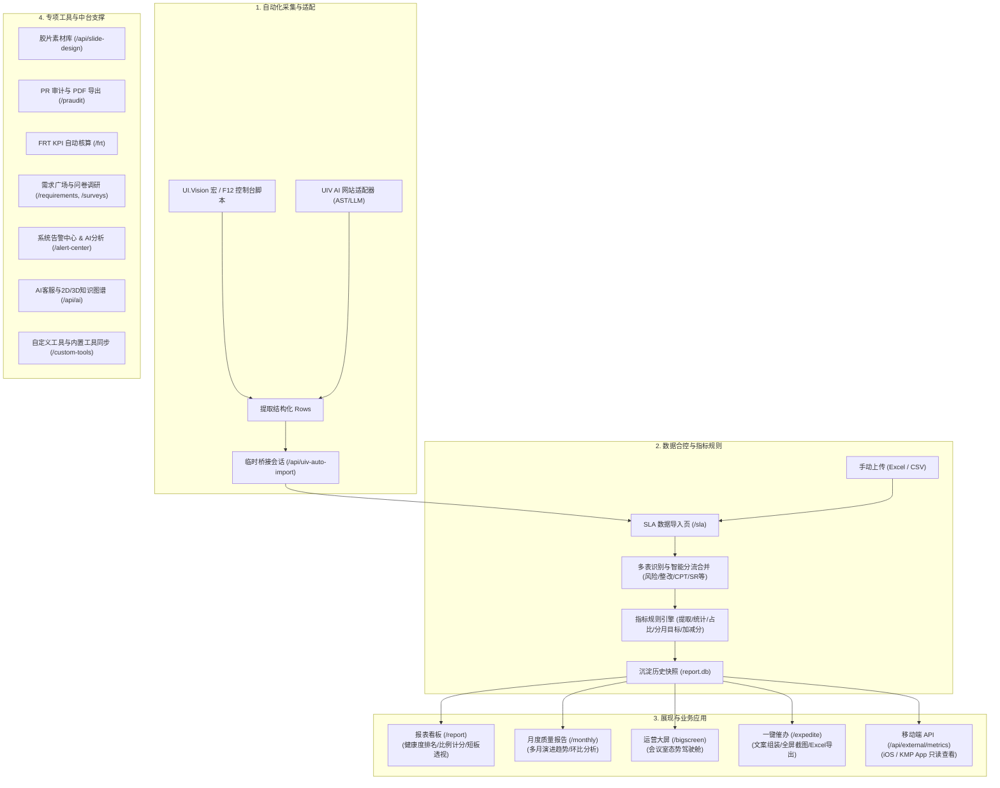
```mermaid
flowchart TD
    subgraph 采集层["1. 自动化采集与适配"]
        A1["UI.Vision 宏 / F12 控制台脚本"] --> A3["提取结构化 Rows"]
        A2["UIV AI 网站适配器 (AST/LLM)"] --> A3
        A3 --> A4["临时桥接会话 (/api/uiv-auto-import)"]
    end

    subgraph 合控层["2. 数据合控与指标规则"]
        A4 --> B1["SLA 数据导入页 (/sla)"]
        B2["手动上传 (Excel / CSV)"] --> B1
        B1 --> B3["多表识别与智能分流合并 (风险/整改/CPT/SR等)"]
        B3 --> B4["指标规则引擎 (提取/统计/占比/分月目标/加减分)"]
        B4 --> B5["沉淀历史快照 (report.db)"]
    end

    subgraph 展现与应用层["3. 展现与业务应用"]
        B5 --> C1["报表看板 (/report)<br/>(健康度排名/比例计分/短板透视)"]
        B5 --> C2["月度质量报告 (/monthly)<br/>(多月演进趋势/环比分析)"]
        B5 --> C3["运营大屏 (/bigscreen)<br/>(会议室态势驾驶舱)"]
        B5 --> C4["一键催办 (/expedite)<br/>(文案组装/全屏截图/Excel导出)"]
        B5 --> C5["移动端 API (/api/external/metrics)<br/>(iOS / KMP App 只读查看)"]
    end

    subgraph 支撑与治理层["4. 专项工具与中台支撑"]
        D1["胶片素材库 (/api/slide-design)"]
        D2["PR 审计与 PDF 导出 (/praudit)"]
        D3["FRT KPI 自动核算 (/frt)"]
        D4["需求广场与问卷调研 (/requirements, /surveys)"]
        D5["系统告警中心 & AI分析 (/alert-center)"]
        D6["AI客服与2D/3D知识图谱 (/api/ai)"]
        D7["自定义工具与内置工具同步 (/custom-tools)"]
    end
```

---

## 2. 核心业务与功能详析 (含业务流程图)

### 2.1 自动化数据抓取与 UIVF12 AI 网站适配器

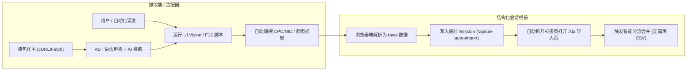
```mermaid
flowchart LR
    subgraph 抓取与推断["抓取端 / 适配器"]
        U1["用户 / 自动化调度"] --> U2["运行 UI.Vision / F12 脚本"]
        U2 --> U3["自动嗅探 CPC/NID / 翻页抓取"]
        U4["抓包样本 (cURL/Fetch)"] --> U5["AST 语法解析 + AI 推断"]
        U5 --> U2
    end
    subgraph 免传流转["结构化会话桥接"]
        U3 --> U6["浏览器端解析为 rows 数据"]
        U6 --> U7["写入临时 Session (/api/uiv-auto-import)"]
        U7 --> U8["自动新开标签页打开 /sla 导入页"]
        U8 --> U9["触发智能分流合并 (无需传 CSV)"]
    end
```

- **脚本工程仓库**：集中维护生产级 UI.Vision Macro JSON 和 F12 控制台脚本，实现按系统模块分类、版本迭代、语法高亮与快速检索。
- **调度引擎特性**：
  - **智能 CPC/NID 嗅探**：动态识别当前登录账号权限、所属组织节点与大区上下文。
  - **分页与重试机制**：自动注入防掉登探测、网络波动自动重试、批量连续翻页与跨大区阵列调度。
  - **双月裂变执行**：在跨月窗口期自动分裂为当月与上月两条抓取任务线。
- **UIV AI 网站适配器 (`/api/uiv-ai-adapter`)**：
  - 将抓包请求（Fetch/cURL）输入后，后端结合 **AST 语法树解析 (Acorn)** 与大模型，自动分析请求结构并严格脱敏敏感头 (`Authorization/Cookie`)，生成可执行代码。
- **免上传自动导入流转 (`/api/uiv-auto-import`)**：
  - 抓取完成后，直接将 rows 数据送入服务端临时会话并唤起 `/sla`，彻底免去手动下载和上传 CSV。

---

### 2.2 SLA 数据合控与指标规则引擎

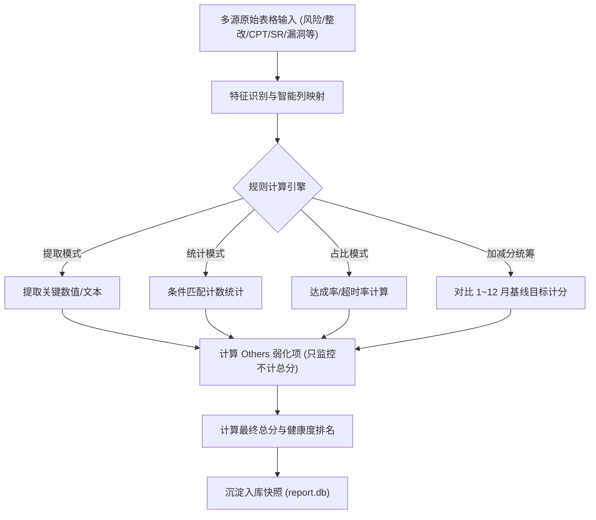
```mermaid
flowchart TD
    A["多源原始表格输入 (风险/整改/CPT/SR/漏洞等)"] --> B["特征识别与智能列映射"]
    B --> C{"规则计算引擎"}
    C -->|提取模式| D1["提取关键数值/文本"]
    C -->|统计模式| D2["条件匹配计数统计"]
    C -->|占比模式| D3["达成率/超时率计算"]
    C -->|加减分统筹| D4["对比 1~12 月基线目标计分"]
    D1 & D2 & D3 & D4 --> E["计算 Others 弱化项 (只监控不计总分)"]
    E --> F["计算最终总分与健康度排名"]
    F --> G["沉淀入库快照 (report.db)"]
```

- **多源数据特征自动识别**：
  - 自动识别日常运维中的 8 大类表格：**风险表、整改表、CPT任务表、SR工单表、漏洞表、红线表、业务比对表、日志稽查表**等。
  - 采用智能列名归一化与相似度算法，支持异构表格列自动映射。
- **指标与子指标规则引擎**：
  - **计算模式**：支持提取值、计数统计、占比百分比、加减分统筹等多种计算逻辑。
  - **分月目标基线**：支持针对 1~12 个月分别设定差异化的目标基线值。
  - **预警呼吸灯与倒计时**：基于剩余处理时间与 SLA 阈值，前端动态渲染红/黄/绿呼吸灯与倒计时标签。
- **偏好持久化与快照管理**：
  - 用户配置的列宽、显隐、冻结列、排序、计算开关保存在 `tools.db`；入库历史快照沉淀至 `report.db`。

<!-- DEFAULT_QUICK_START_BEGIN -->
### 默认快速上手包

项目第一次启动后（Windows 安装版、绿色免安装版和源代码启动一致），超级管理员首次进入页面会看到一次性引导，可分别选择导入“默认智能调度脚本仓库”和“全量指标规则”，也可两项都不导入。选择保存在当前运行数据目录的 `first-run-defaults.json`，不依赖浏览器缓存，因此各启动形态行为一致。

首次没有手动选择过语言时，引导界面会优先跟随浏览器语言：英文浏览器显示英文，其他语言默认显示中文；用户通过顶部语言按钮做出的选择优先级最高。

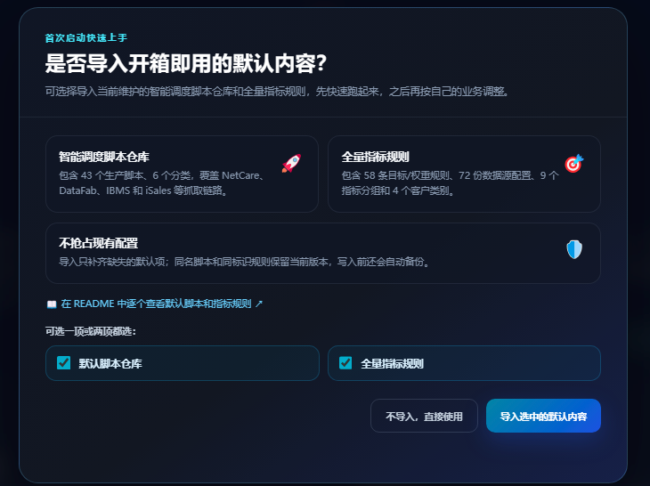

> 首次启动界面会直接列出默认脚本仓库、全量指标规则和“不抢占现有配置”的导入策略；管理员可只选其中一项，也可暂不导入直接使用。

- 导入策略是 **只补齐、不覆盖**：现有同名脚本、同 ID/同名分组和同 key 指标规则保留用户版本。
- 真正写入前会在 `backups/first-run-defaults/` 生成 JSON 备份；任一步失败会尝试回滚。
- 默认包是可版本化的静态快照，发布前运行 `npm run defaults:export` 可用当前 `tools.db` 重新生成。
- 脚本不携带固定 Cookie、Authorization 或口令；运行时从用户已登录的目标系统会话动态取得令牌。使用前仍需确认目标系统授权、地区/代表处参数和数据合规要求。

管理员后续可进入 **全局设置 → 初始化**：

- **启动开箱即用模式**：再次补齐仓库内置脚本和全量指标规则，仍采用“只补齐、不覆盖”，适合首次跳过或后续默认包升级后使用。
- **彻底初始化当前租户**：要求输入 `RESET` 二次确认；系统先生成当前租户的 `pre-factory-reset` 安全备份，再归档该租户数据并建立干净数据库。账号、其他租户、桌面授权和 F12 授权不受影响；初始化后该租户会再次出现首次导入引导。为保护历史数据，默认租户在已经创建其他租户后禁止整库初始化。
- 如果需要恢复初始化前状态，可从“备份恢复”使用安全备份，或由管理员从 `factory-reset-archives/` 完整归档人工恢复。执行期间不要强制结束初始化工作进程。

本版默认包摘要：**43** 个脚本、**6** 个脚本分类、**58** 条目标/权重规则、**72** 份偏好与数据源规则、**9** 个指标分组、**4** 个客户类别和 **137** 个双语字典词条。

#### 默认智能调度脚本（逐个说明）

| 仓库分类 | 脚本 | 用途 |
|---|---|---|
| NetCare中国 | PBI_自动抓取-数字证书 | 抓取数字证书整改/达成数据，供证书指标核算。 |
| NetCare中国 | PBI_自动抓取-锂电池 | 抓取锂电池治理数据，供锂电达成率指标核算。 |
| NetCare中国 | PBI_自动抓取-重急EOS风险 | 抓取重急 EOS 风险库存与处置进度。 |
| NetCare中国 | PBI_自动抓取-版本EOS风险 | 抓取版本级 EOS 风险与收编进度。 |
| NetCare中国 | PBI_自动抓取-产品EOS风险 | 抓取产品级 EOS 风险与收编进度。 |
| NetCare中国 | PBI_自动抓取-SRFRT-CN | 抓取中国区 SR FRT 数据，供首次响应达成率核算。 |
| NetCare中国 | PBI_自动抓取-事故-CN | 抓取中国区事故数据，供恶性事故数量监控。 |
| NetCare中国 | PBI_自动抓取-路由器整改 | 抓取路由器整改进度和明细。 |
| NetCare中国 | PBI_自动抓取-数据存储整改 | 抓取数据存储整改进度和明细。 |
| NetCare中国 | PBI_自动抓取-软件MM收编/停退 | 抓取“软件MM收编/停退”业务数据，供后续 SLA 合控和报表使用。 |
| NetCare中国 | PBI_自动抓取-风险详单-CN | 抓取中国区 NetCare 风险明细，用于风险合控。 |
| NetCare德国 | PBI_自动抓取-风险详单-DE | 抓取德国 NetCare 风险明细，用于风险合控。 |
| NetCare中国 | PBI_自动抓取-CPT风险详表-CN | 抓取中国区 CPT 风险详表。 |
| NetCare德国 | PBI_自动抓取-CPT风险详表-DE | 抓取德国 CPT 风险详表。 |
| DataFab | PBI_自动抓取_逃生演练 | 抓取逃生演练达成率汇总数据。 |
| DataFab | PBI_自动抓取-整改详单_整改 | 抓取整改任务明细，用于进度和超期核算。 |
| DataFab | PBI_自动抓取_整改 | 抓取整改看板汇总数据，用于整改达成率。 |
| DataFab | PBI_自动抓取_维护红线资源 | 抓取维护红线资源汇总数据。 |
| DataFab | PBI_自动抓取-任职匹配度_维护红线资源 | 抓取维护红线岗位任职匹配度。 |
| DataFab | PBI_自动抓取-红线人员工单统计_维护红线资源 | 抓取红线人员工单量，用于低工单/零工单监控。 |
| DataFab | PBI_自动抓取_17_CN_业务比对报告看板_CO | 抓取业务比对看板汇总数据。 |
| DataFab | PBI_自动抓取-业务比对明细_17_CN_业务比对报告看板_CO | 抓取业务比对任务明细，用于回传和备案核算。 |
| DataFab | PBI_自动抓取_日志稽查率CN | 抓取日志稽查达成率。 |
| DataFab | PBI_自动抓取_图形化拦截_CN | 抓取图形化命令拦截汇总数据。 |
| DataFab | PBI_自动抓取_ADMS_事中：高危命令拦截人员管理 | 抓取 ADMS 高危命令拦截人员数据。 |
| DataFab | PBI_自动抓取_延期操作补授权监控 | 抓取延期操作补授权进度。 |
| DataFab | PBI_自动抓取_产品TOPN风险 | 抓取产品 TOPN 风险整改数据。 |
| DataFab | PBI_自动抓取_预案拓扑 | 抓取应急预案和网络拓扑覆盖情况。 |
| DataFab | PBI_自动抓取_应急演练 | 抓取 iLab/应急演练完成进度。 |
| DataFab | PBI_自动抓取_价值网络巡检 | 抓取价值网络巡检汇总与 HC 数据。 |
| DataFab | PBI_自动抓取-巡检详单_价值网络巡检 | 抓取价值网络巡检明细，识别未完成巡检单。 |
| DataFab | PBI_自动抓取-详单_逃生演练 | 抓取逃生演练明细，支持客户群穿透。 |
| DataFab | PBI_自动抓取-详单_图形化拦截_CN | 抓取图形化拦截明细，支持原因穿透。 |
| DataFab | PBI_自动抓取_漏洞预警 | 抓取漏洞预警汇总与闭环进度。 |
| NetCare中国 | PBI_自动抓取-详单-SR-CN | 抓取中国区 SR 工单明细，支持 SLA/FRT 分析。 |
| NetCare中国 | PBI_自动抓取-详单预警冒泡_026902-CN | 抓取 SR/风险预警冒泡明细。 |
| DataFab | PBI_自动抓取-详单漏洞_漏洞预警 | 抓取漏洞预警明细，支持漏洞穿透。 |
| DataFab | PBI_自动抓取_15_CN_事前：操作资质积分_CO | 抓取事前操作资质积分和人员风险数据。 |
| DataFab | PBI_自动抓取-明细红线_维护红线资源 | 抓取维护红线人员明细，支撑风险人员识别。 |
| NetCare中国 | PBI_自动抓取-重疾软件EOS | 抓取重疾软件 EOS 库存与预案数据。 |
| NetCare中国 | PBI_自动抓取-重急EOS收编 | 抓取分年份重急 EOS 收编进度。 |
| IBMS&ISALES | IBMS | 抓取 IBMS 完成情况，支持 IBMS 达成率指标。 |
| IBMS&ISALES | isales-summit | 抓取 iSales 服务峰会/客户活动数据。 |

#### 默认数据源/偏好规则（逐个说明）

以下每个 `sla_prefs_*` 条目都是一份可匹配到具体导入表的规则档案；除了自定义指标，还包含列显隐、列宽、排序和数据源识别元数据。

| 配置 Key | 数据源/全局项 | 规则内容 |
|---|---|---|
| `expediteIgnoreKeywords` | expediteIgnoreKeywords | 一键催办忽略关键词。 |
| `expediteTemplate` | expediteTemplate | 一键催办默认文案模板。 |
| `i18nMap` | i18nMap | 指标中英文字典，共 137 个词条。 |
| `isAutoStandardTotalScore` | isAutoStandardTotalScore | 标准总分自动计算开关。 |
| `manualAdjustAutoFill` | manualAdjustAutoFill | 手工加减分自动填充配置。 |
| `manualAdjustItems` | manualAdjustItems | 手工加减分项清单，共 22 项。 |
| `sla_builtin_rule_risk_v1` | sla_builtin_rule_risk_v1 | 常规风险表的内置状态、时间和告警分级规则。 |
| `sla_prefs_other_16amqd` | PBI_自动抓取-任职匹配度_维护红线资源_Latest | 自定义指标：任职率；1 个主指标、0 个客户群子指标。 |
| `sla_prefs_other_1c0vz` | IBMS | 自定义指标：IBMS；1 个主指标、0 个客户群子指标。 |
| `sla_prefs_other_1es9ww` | Report_mqukzpsh | 保存该数据源的列显隐、宽度、排序与识别信息；当前未定义顶部自定义指标。 |
| `sla_prefs_other_36ksoy` | PBI_自动抓取-重急EOS风险_Latest | 自定义指标：重急EOS、重疾EOS预案覆盖率；2 个主指标、8 个客户群子指标。 |
| `sla_prefs_other_3i73d` | PBI_自动抓取_维护红线资源_Latest | 自定义指标：维护红线岗；1 个主指标、0 个客户群子指标。 |
| `sla_prefs_other_4eeqp1` | transaction-history | 保存该数据源的列显隐、宽度、排序与识别信息；当前未定义顶部自定义指标。 |
| `sla_prefs_other_4xrqmw` | PBI_自动抓取-事故_Latest | 自定义指标：事故；1 个主指标、0 个客户群子指标。 |
| `sla_prefs_other_5jcrzk` | PBI_自动抓取_应急演练_Latest | 自定义指标：iLab 应急演练；1 个主指标、3 个客户群子指标。 |
| `sla_prefs_other_a33iom` | PBI_自动抓取-版本EOS风险_Latest | 自定义指标：全量EOS-版本；1 个主指标、4 个客户群子指标。 |
| `sla_prefs_other_a9v3sp` | PBI_自动抓取-重疾软件EOS_Latest | 自定义指标：重疾软件EOS；1 个主指标、4 个客户群子指标。 |
| `sla_prefs_other_adofvo` | PBI_自动抓取_日志稽查率CN_Latest | 自定义指标：日志稽查；1 个主指标、3 个客户群子指标。 |
| `sla_prefs_other_b4qno2` | PBI_自动抓取-业务比对明细_17_CN_业务比对报告看板_CO_Latest | 保存该数据源的列显隐、宽度、排序与识别信息；当前未定义顶部自定义指标。 |
| `sla_prefs_other_blghgh` | PBI_自动抓取-路由器整改_Latest | 自定义指标：路由器；1 个主指标、4 个客户群子指标。 |
| `sla_prefs_other_byn3uq` | PBI_自动抓取_延期操作补授权监控_Latest | 自定义指标：延期补授权；1 个主指标、0 个客户群子指标。 |
| `sla_prefs_other_ccmx6n` | PBI_自动抓取-红线人员工单统计_维护红线资源_Latest | 自定义指标：工单<1人数、0工单；2 个主指标、0 个客户群子指标。 |
| `sla_prefs_other_cs4972` | PBI_自动抓取-软件MM收编_停退_Latest | 自定义指标：软件MM；1 个主指标、0 个客户群子指标。 |
| `sla_prefs_other_d634kw` | sla_prefs_other_d634kw | 保存该数据源的列显隐、宽度、排序与识别信息；当前未定义顶部自定义指标。 |
| `sla_prefs_other_djz3q` | sla_prefs_other_djz3q | 保存该数据源的列显隐、宽度、排序与识别信息；当前未定义顶部自定义指标。 |
| `sla_prefs_other_dxi147` | PBI_自动抓取-明细红线_维护红线资源_Latest | 自定义指标：任职/任命不满足人数；1 个主指标、0 个客户群子指标。 |
| `sla_prefs_other_fvv9vu` | PBI_自动抓取-巡检详单_价值网络巡检_Latest | 自定义指标：未完成价值网络巡检单数；1 个主指标、3 个客户群子指标。 |
| `sla_prefs_other_g6zjrl` | PBI_自动抓取-详单_逃生演练_Latest | 保存该数据源的列显隐、宽度、排序与识别信息；当前未定义顶部自定义指标。 |
| `sla_prefs_other_ibnj66` | PBI_自动抓取_15_CN_事前：操作资质积分_CO_Latest | 自定义指标：高风险人员、超高风险人员；2 个主指标、0 个客户群子指标。 |
| `sla_prefs_other_irg0bu` | PBI_自动抓取-数字证书_Latest | 自定义指标：数字证书；1 个主指标、4 个客户群子指标。 |
| `sla_prefs_other_ju1fve` | PBI_自动抓取-详单_图形化拦截_CN_Latest | 保存该数据源的列显隐、宽度、排序与识别信息；当前未定义顶部自定义指标。 |
| `sla_prefs_other_k9sq8x` | PBI_自动抓取-SRFRT_Latest | 自定义指标：SR FRT；1 个主指标、4 个客户群子指标。 |
| `sla_prefs_other_kdv95b` | 美元到人民币 | 保存该数据源的列显隐、宽度、排序与识别信息；当前未定义顶部自定义指标。 |
| `sla_prefs_other_kxxuiv` | PBI_自动抓取_ADMS_事中：高危命令拦截人员管理_Latest | 自定义指标：高危命令拦截；1 个主指标、3 个客户群子指标。 |
| `sla_prefs_other_n0fxcz` | PBI_自动抓取-锂电池_Latest | 自定义指标：锂电；1 个主指标、1 个客户群子指标。 |
| `sla_prefs_other_nbbmhr` | PBI_自动抓取_漏洞预警_Latest | 自定义指标：漏洞；1 个主指标、0 个客户群子指标。 |
| `sla_prefs_other_pufzvl` | PBI_自动抓取_价值网络巡检_Latest | 自定义指标：价值网络HC；1 个主指标、3 个客户群子指标。 |
| `sla_prefs_other_qud1i1` | PBI_自动抓取-重急EOS收编_Latest | 自定义指标：重急EOS收编2025、重急EOS收编2026；2 个主指标、8 个客户群子指标。 |
| `sla_prefs_other_r7ivhq` | PBI_自动抓取_预案拓扑_Latest | 自定义指标：拓扑、预案；2 个主指标、8 个客户群子指标。 |
| `sla_prefs_other_renltd` | PBI_自动抓取-数据存储整改_Latest | 自定义指标：存储整改；1 个主指标、4 个客户群子指标。 |
| `sla_prefs_other_scojkl` | PBI_自动抓取_整改_Latest | 自定义指标：整改；1 个主指标、4 个客户群子指标。 |
| `sla_prefs_other_tl0h8g` | PBI_自动抓取-产品EOS风险_Latest | 自定义指标：全量EOS-产品；1 个主指标、4 个客户群子指标。 |
| `sla_prefs_other_tye0xk` | sla_prefs_other_tye0xk | 保存该数据源的列显隐、宽度、排序与识别信息；当前未定义顶部自定义指标。 |
| `sla_prefs_other_uxx002` | PBI_自动抓取_产品TOPN风险_Latest | 自定义指标：TOPN 风险；1 个主指标、4 个客户群子指标。 |
| `sla_prefs_other_v7jtrw` | PBI_自动抓取_图形化拦截_CN_Latest | 自定义指标：GUI拦截次数；1 个主指标、3 个客户群子指标。 |
| `sla_prefs_other_vmy0fv` | PBI_自动抓取_逃生演练_Latest | 自定义指标：逃生演练；1 个主指标、3 个客户群子指标。 |
| `sla_prefs_other_vsq8j3` | PBI_自动抓取_17_CN_业务比对报告看板_CO_Latest | 自定义指标：日志回传、日志回传备案；2 个主指标、6 个客户群子指标。 |
| `sla_prefs_other_wxu3j2` | PBI_自动抓取-详单预警冒泡_Latest | 保存该数据源的列显隐、宽度、排序与识别信息；当前未定义顶部自定义指标。 |
| `sla_prefs_rectification_swtui4` | sla_prefs_rectification_swtui4 | 保存该数据源的列显隐、宽度、排序与识别信息；当前未定义顶部自定义指标。 |
| `sla_prefs_rectification_x7jydx` | 整改详单合集 | 保存该数据源的列显隐、宽度、排序与识别信息；当前未定义顶部自定义指标。 |
| `sla_prefs_risk_2g5f4q` | sla_prefs_risk_2g5f4q | 保存该数据源的列显隐、宽度、排序与识别信息；当前未定义顶部自定义指标。 |
| `sla_prefs_risk_bwy2wp` | ️ 常规风险合集 | 保存该数据源的列显隐、宽度、排序与识别信息；当前未定义顶部自定义指标。 |
| `sla_prefs_risk_eunoq8` | sla_prefs_risk_eunoq8 | 保存该数据源的列显隐、宽度、排序与识别信息；当前未定义顶部自定义指标。 |
| `sla_prefs_risk_g62vve` | ️ 常规风险合集 | 保存该数据源的列显隐、宽度、排序与识别信息；当前未定义顶部自定义指标。 |
| `sla_prefs_risk_tfawpd` | sla_prefs_risk_tfawpd | 保存该数据源的列显隐、宽度、排序与识别信息；当前未定义顶部自定义指标。 |
| `sla_prefs_risk_xjn92q` | ️ 常规风险合集 | 保存该数据源的列显隐、宽度、排序与识别信息；当前未定义顶部自定义指标。 |
| `sla_prefs_special_4ny14x` | sla_prefs_special_4ny14x | 保存该数据源的列显隐、宽度、排序与识别信息；当前未定义顶部自定义指标。 |
| `sla_prefs_special_7nigy9` | sla_prefs_special_7nigy9 | 保存该数据源的列显隐、宽度、排序与识别信息；当前未定义顶部自定义指标。 |
| `sla_prefs_special_xg6eua` | ️ CPT专项风险合集 | 保存该数据源的列显隐、宽度、排序与识别信息；当前未定义顶部自定义指标。 |
| `sla_prefs_sr_1r3rw1` | sla_prefs_sr_1r3rw1 | 保存该数据源的列显隐、宽度、排序与识别信息；当前未定义顶部自定义指标。 |
| `sla_prefs_sr_5w97d7` | SR详单分析 | 保存该数据源的列显隐、宽度、排序与识别信息；当前未定义顶部自定义指标。 |
| `sla_prefs_sr_8rjdx9` | sla_prefs_sr_8rjdx9 | 保存该数据源的列显隐、宽度、排序与识别信息；当前未定义顶部自定义指标。 |
| `sla_prefs_sr_ahu3bc` | sla_prefs_sr_ahu3bc | 保存该数据源的列显隐、宽度、排序与识别信息；当前未定义顶部自定义指标。 |
| `sla_prefs_sr_curpon` | sla_prefs_sr_curpon | 保存该数据源的列显隐、宽度、排序与识别信息；当前未定义顶部自定义指标。 |
| `sla_prefs_sr_f7fxxk` | sla_prefs_sr_f7fxxk | 保存该数据源的列显隐、宽度、排序与识别信息；当前未定义顶部自定义指标。 |
| `sla_prefs_sr_j7joro` | SR详单分析 | 保存该数据源的列显隐、宽度、排序与识别信息；当前未定义顶部自定义指标。 |
| `sla_prefs_sr_n01rwj` | SR详单分析 | 保存该数据源的列显隐、宽度、排序与识别信息；当前未定义顶部自定义指标。 |
| `sla_prefs_sr_ntg995` | sla_prefs_sr_ntg995 | 保存该数据源的列显隐、宽度、排序与识别信息；当前未定义顶部自定义指标。 |
| `sla_prefs_sr_ocybva` | sla_prefs_sr_ocybva | 保存该数据源的列显隐、宽度、排序与识别信息；当前未定义顶部自定义指标。 |
| `sla_prefs_sr_qkuxx8` | sla_prefs_sr_qkuxx8 | 保存该数据源的列显隐、宽度、排序与识别信息；当前未定义顶部自定义指标。 |
| `sla_prefs_vulnerability_7jo3jx` | 漏洞预警详单 | 保存该数据源的列显隐、宽度、排序与识别信息；当前未定义顶部自定义指标。 |
| `sla_prefs_vulnerability_qft6ym` | sla_prefs_vulnerability_qft6ym | 保存该数据源的列显隐、宽度、排序与识别信息；当前未定义顶部自定义指标。 |

#### 默认目标、权重与达标方向（逐个说明）

`gte` 表示“越高越好”，`lte` 表示“越低越好”。表中“分月目标”完整列出当前默认包已配置的月份；未设置的手工经营指标需由管理员按实际业务补充。

| 指标 | 规则 Key | 达标与权重 | 分月目标 |
|---|---|---|---|
| IBMS | `manual_target_1778881260277` | 实际值 ≥ 目标时达标；权重 2分。 | 5–12月：100 |
| 月度例会 | `manual_target_1778882000001` | 实际值 ≥ 目标时达标；权重 2分。 | 5–12月：1 |
| Jam服务专刊/季度 | `manual_target_1778882000002` | 实际值 ≥ 目标时达标；权重 3分。 | 5–12月：1 |
| 服务峰会/半年 | `manual_target_1778882000003` | 实际值 ≥ 目标时达标；权重 3分。 | 5–12月：1 |
| Jam客户活动/月度 | `manual_target_1778882000004` | 实际值 ≥ 目标时达标；权重 2分。 | 5–12月：1 |
| L4骨干 | `manual_target_1778882000005` | 实际值 ≥ 目标时达标；权重 1分。 | 5–12月：1 |
| 员工能力 | `manual_target_1778882000006` | 实际值 ≥ 目标时达标；权重 1分。 | 5–12月：1 |
| 专家讲座分享 | `manual_target_1778882000007` | 实际值 ≥ 目标时达标；权重 1分。 | 5–12月：1 |
| 项目复盘学习 | `manual_target_1778882000008` | 实际值 ≥ 目标时达标；权重 1分。 | 5–12月：1 |
| 青年人才培养 | `manual_target_1778882000009` | 实际值 ≥ 目标时达标；权重 1分。 | 5–12月：1 |
| 网络韧性 | `manual_target_1778882000010` | 实际值 ≥ 目标时达标；权重 0分。 | 未设置分月值（待按业务填写） |
| 风险感知 | `manual_target_1778882000011` | 实际值 ≥ 目标时达标；权重 0分。 | 未设置分月值（待按业务填写） |
| 维保订单 | `manual_target_1778900000001` | 实际值 ≥ 目标时达标；权重 2分。 | 未设置分月值（待按业务填写） |
| 过保订单及SPMS | `manual_target_1778900000002` | 实际值 ≥ 目标时达标；权重 8分。 | 未设置分月值（待按业务填写） |
| 业务收入 | `manual_target_1778900000003` | 实际值 ≥ 目标时达标；权重 5分。 | 未设置分月值（待按业务填写） |
| PS GP利润率 | `manual_target_1778900000004` | 实际值 ≥ 目标时达标；权重 5分。 | 未设置分月值（待按业务填写） |
| TE备件短缺解决方案 | `manual_target_1778900000005` | 实际值 ≥ 目标时达标；权重 5分。 | 未设置分月值（待按业务填写） |
| TE AOS 2.0过保订单 | `manual_target_1778900000006` | 实际值 ≥ 目标时达标；权重 5分。 | 未设置分月值（待按业务填写） |
| ORG AOS 2.0过保订单 | `manual_target_1778900000007` | 实际值 ≥ 目标时达标；权重 10分。 | 未设置分月值（待按业务填写） |
| VDF AOS 2.0过保订单 | `manual_target_1778900000008` | 实际值 ≥ 目标时达标；权重 10分。 | 未设置分月值（待按业务填写） |
| ET成本控制(GPR提升10%) | `manual_target_1778900000009` | 实际值 ≥ 目标时达标；权重 10分。 | 未设置分月值（待按业务填写） |
| 任职率 | `other_16amqd_m_1778786853776` | 实际值 ≥ 目标时达标；权重 1分。 | 5–12月：100 |
| IBMS | `other_1c0vz_m_1783578265717` | 实际值 ≥ 目标时达标；权重 未设置分。 | 5–12月：100 |
| 重急EOS | `other_36ksoy_m_1778705593174` | 实际值 ≥ 目标时达标；权重 3分。 | 5月 40 / 6月 50 / 7月 60 / 8月 70 / 9月 80 / 10月 90 / 11月 100 / 12月 100 |
| 重疾EOS预案覆盖率 | `other_36ksoy_m_1781984663938` | 实际值 ≥ 目标时达标；权重 1分。 | 5–12月：100 |
| 维护红线岗 | `other_3i73d_m_1778791639908` | 实际值 ≥ 目标时达标；权重 1分。 | 5–12月：100 |
| 事故 | `other_4xrqmw_m_1778786511235` | 实际值 ≤ 目标时达标；权重 1分。 | 5–12月：1 |
| iLab 应急演练 | `other_5jcrzk_m_1778790896339` | 实际值 ≥ 目标时达标；权重 2分。 | 5月 35 / 6月 45 / 7月 55 / 8月 65 / 9月 75 / 10月 85 / 11月 100 / 12月 100 |
| 全量EOS-版本 | `other_a33iom_m_1778706872642` | 实际值 ≥ 目标时达标；权重 1.5分。 | 5月 40 / 6月 50 / 7月 60 / 8月 70 / 9月 80 / 10月 90 / 11月 100 / 12月 100 |
| 重疾软件EOS | `other_a9v3sp_m_1781984381332` | 实际值 ≥ 目标时达标；权重 1分。 | 5月 10 / 6月 10 / 7月 11 / 8月 12 / 9月 13 / 10月 14 / 11月 15 / 12月 16 |
| 日志稽查 | `other_adofvo_m_1779032730680` | 实际值 ≥ 目标时达标；权重 2分。 | 5–12月：80 |
| 路由器 | `other_blghgh_m_1778787005176` | 实际值 ≥ 目标时达标；权重 5分。 | 5月 40 / 6月 60 / 7月 70 / 8月 80 / 9月 90 / 10月 100 / 11月 100 / 12月 100 |
| 延期补授权 | `other_byn3uq_m_1778791415417` | 实际值 ≥ 目标时达标；权重 1分。 | 5–12月：100 |
| 工单<1人数 | `other_ccmx6n_m_1778787671971` | 实际值 ≤ 目标时达标；权重 1分。 | 5–12月：0 |
| 0工单 | `other_ccmx6n_m_1780821731020` | 实际值 ≤ 目标时达标；权重 1分。 | 5–12月：0 |
| 软件MM | `other_cs4972_m_1778786563981` | 实际值 ≥ 目标时达标；权重 1分。 | 5–12月：100 |
| 任职/任命不满足人数 | `other_dxi147_m_1781985014738` | 实际值 ≤ 目标时达标；权重 1分。 | 5–12月：0 |
| 未完成价值网络巡检单数 | `other_fvv9vu_m_1778874886825` | 实际值 ≤ 目标时达标；权重 1分。 | 5–12月：0 |
| 高风险人员 | `other_ibnj66_m_1780824661415` | 实际值 ≤ 目标时达标；权重 1分。 | 5–12月：0 |
| 超高风险人员 | `other_ibnj66_m_1780824676604` | 实际值 ≤ 目标时达标；权重 1分。 | 5–12月：0 |
| 数字证书 | `other_irg0bu_m_1778785490158` | 实际值 ≥ 目标时达标；权重 5分。 | 5月 30 / 6月 50 / 7月 70 / 8月 90 / 9月 100 / 10月 100 / 11月 100 / 12月 100 |
| SR FRT | `other_k9sq8x_m_1778788023171` | 实际值 ≥ 目标时达标；权重 1分。 | 5–12月：98.5 |
| 高危命令拦截 | `other_kxxuiv_m_1778707460232` | 实际值 ≤ 目标时达标；权重 1分。 | 5–12月：50 |
| 锂电 | `other_n0fxcz_m_1778787483188` | 实际值 ≥ 目标时达标；权重 5分。 | 5–12月：100 |
| 漏洞 | `other_nbbmhr_m_1780165781641` | 实际值 ≥ 目标时达标；权重 1分。 | 5–12月：100 |
| 价值网络HC | `other_pufzvl_m_1778792227261` | 实际值 ≥ 目标时达标；权重 5分。 | 5月 90 / 6月 100 / 7月 100 / 8月 100 / 9月 100 / 10月 100 / 11月 100 / 12月 100 |
| 重急EOS收编2025 | `other_qud1i1_m_1781983645878` | 实际值 ≥ 目标时达标；权重 1分。 | 5月 40 / 6月 40 / 7月 45 / 8月 50 / 9月 55 / 10月 60 / 11月 65 / 12月 70 |
| 重急EOS收编2026 | `other_qud1i1_m_1781983675539` | 实际值 ≥ 目标时达标；权重 1分。 | 5–12月：3 |
| 拓扑 | `other_r7ivhq_m_1778790642772` | 实际值 ≥ 目标时达标；权重 1分。 | 5–12月：100 |
| 预案 | `other_r7ivhq_m_1778790662446` | 实际值 ≥ 目标时达标；权重 1分。 | 5–12月：100 |
| 存储整改 | `other_renltd_m_1778786309907` | 实际值 ≥ 目标时达标；权重 1分。 | 5月 16 / 6月 60 / 7月 70 / 8月 80 / 9月 90 / 10月 100 / 11月 100 / 12月 100 |
| 整改 | `other_scojkl_m_1778788213878` | 实际值 ≥ 目标时达标；权重 5分。 | 5月 40 / 6月 60 / 7月 70 / 8月 80 / 9月 90 / 10月 100 / 11月 100 / 12月 100 |
| 全量EOS-产品 | `other_tl0h8g_m_1778705794580` | 实际值 ≥ 目标时达标；权重 1.5分。 | 5月 40 / 6月 50 / 7月 60 / 8月 70 / 9月 80 / 10月 90 / 11月 100 / 12月 100 |
| TOPN 风险 | `other_uxx002_m_1778792452712` | 实际值 ≥ 目标时达标；权重 5分。 | 5月 70 / 6月 90 / 7月 100 / 8月 100 / 9月 100 / 10月 100 / 11月 100 / 12月 100 |
| GUI拦截次数 | `other_v7jtrw_m_1779277760371` | 实际值 ≤ 目标时达标；权重 1分。 | 5–12月：100 |
| 逃生演练 | `other_vmy0fv_m_1778791792772` | 实际值 ≥ 目标时达标；权重 5分。 | 5月 50 / 6月 50 / 7月 50 / 8月 70 / 9月 70 / 10月 100 / 11月 100 / 12月 100 |
| 日志回传 | `other_vsq8j3_m_1778792882724` | 实际值 ≥ 目标时达标；权重 1分。 | 5–12月：95 |
| 日志回传备案 | `other_vsq8j3_m_1778792901855` | 实际值 ≤ 目标时达标；权重 1分。 | 5–12月：25 |

#### 默认指标分组（逐个说明）

默认客户类别为：TE、ORG、ET、VDF。

| 分组 | 分组 ID | 包含指标 |
|---|---|---|
| Order | `grp_1778920000001` | 过保订单及SPMS、维保订单 |
| Revenue | `grp_1778920000002` | 业务收入 |
| PS GP (%) | `grp_1778920000003` | PS GP利润率 |
| Key Project and Task | `grp_1778920000004` | TE备件短缺解决方案、TE AOS 2.0过保订单、ORG AOS 2.0过保订单、VDF AOS 2.0过保订单、ET成本控制(GPR提升10%) |
| "0" Vicious Incident | `grp_1778915828771` | 整改、TOPN 风险、数字证书、全量EOS-产品、全量EOS-版本、重急EOS、锂电、路由器、日志回传、日志回传备案、日志稽查 |
| "0" Long Time Restore Incident | `grp_1778916107400` | 价值网络HC、网络韧性、风险感知、逃生演练、iLab 应急演练、拓扑、预案、IBMS |
| Value Present | `grp_1778917168901` | 月度例会、Jam服务专刊/季度、服务峰会/半年、Jam客户活动/月度 |
| Capability Improvement | `grp_1778917230508` | L4骨干、员工能力、专家讲座分享、项目复盘学习、青年人才培养 |
| Others | `grp_1778917307362` | 存储整改、软件MM、SR FRT、高危命令拦截、GUI拦截次数、漏洞、任职率、维护红线岗、0工单、延期补授权、事故、未完成价值网络巡检单数、工单<1人数、高风险人员、超高风险人员、重急EOS收编2025、重急EOS收编2026、重疾软件EOS、重疾EOS预案覆盖率、任职/任命不满足人数 |
<!-- DEFAULT_QUICK_START_END -->

### 租户模式与数据隔离

登录后点击右上角“账号名 · 当前租户”可切换租户；管理员可在 **全局设置 → 租户管理** 新增、编辑、归档、恢复或彻底删除租户。租户切换只修改当前登录 Session，不会改变服务进程的全局目录，因此同一服务上的不同浏览器、不同账号或并发请求可以安全访问不同租户。

租户包含两个不同概念：**租户名称**是界面显示文字，可以随时修改，也可以在不同站点使用不同语言；**租户 ID** 是创建时确定的稳定标识，只允许小写字母、数字、下划线和连字符，用于数据目录、Session、备份归属和远端同步。系统判断备份来源时比较 ID，不比较名称。例如名称“华北运营中心”可以对应 ID `north-ops`。

- **默认租户零迁移**：升级后原 `tools.db`、`report.db`、附件和配置仍留在原路径，直接作为 `default` 租户使用，不搬动、不重命名现有业务数据。
- **新租户结构初始化**：新租户先在临时目录中复制当前数据库的表结构，不复制任何业务行；所有数据库都成功后才原子切换为正式目录，失败不会留下半初始化状态。
- **完整业务隔离**：脚本仓库、SLA 规则、报表/月报快照、需求广场、导航与 AI 配置、告警、问卷、自定义工具、图片/PPT 素材、知识库以及首次导入选择都使用当前租户目录。
- **聊天记录租户共享**：聊天正文保存在当前租户的 `chat-history.db`，会话内容对租户成员共享；已读、置顶、收藏和“我的工号”按平台账号分开保存。导入、重导和删除只允许管理员操作。会话类型按 TXT 相对路径的目录段识别：`联系人`/`单聊` 为单聊，`固定群`/`群组`/`群聊` 为群组，`讨论组` 为讨论组；规则升级后会自动修正已入库会话的分类，无需重新解析原文件。
- **浏览器状态隔离**：切换租户时会保存当前租户的业务 `localStorage` 快照并恢复目标租户快照，同时清空临时 `sessionStorage`；登录凭据和语言偏好保持全局，退出账号时会清除所有租户浏览器快照。
- **账号属于全局控制面**：账号、登录 Session、租户清单及桌面/F12 License 不随租户切换。当前版本所有已登录账号都可切换到所有启用租户，只有管理员可以增删改租户。
- **两步删除与归档管理**：先执行“归档”，租户立即停止显示和访问，相关 Session 自动回到默认租户，但数据目录完整保留。已归档租户会持续显示在管理页的“已归档租户”区，可随时恢复启用。
- **彻底删除保护**：只有已归档的非默认租户可以彻底删除；管理员必须在平台自定义高危弹窗中输入完整租户 ID。确认后会关闭该租户数据库连接，并永久删除其数据库、脚本、规则、附件、自定义工具和租户内备份；默认租户始终禁止删除。
- **租户级备份与初始化**：备份、恢复、开箱即用导入和彻底初始化均作用于当前租户。默认租户的备份/恢复明确排除 `tenants/`，不会覆盖其他租户目录；恢复默认租户时还会保留当前账号、Session 与租户登记表。
- **备份租户身份校验**：新备份包在 `manifest.json` 写入 `scope: single-tenant`、`tenantId`、`tenantName` 和 `includesAllTenants: false`。同 ID 直接恢复；不同 ID 首次请求返回结构化 `409 BACKUP_TENANT_MISMATCH`，且不会生成安全备份、关闭数据库或替换文件。管理员在自定义弹窗核对来源与目标后，可以明确选择“确认强制恢复”。早期没有租户标记的兼容包按 `default` 识别。
- **跨租户强制恢复**：确认后先备份目标租户，再把来源租户的脚本、规则、数据库、附件和自定义工具写入目标租户。目标租户 ID、账号、Session、租户清单和其他租户保持不变；该功能适合明确的数据复制/迁移，不会自动改变来源或目标租户名称。
- **远端同租户同步**：手动远端检查、拉取和恢复会先把远端 Session 切换到与本地相同的租户 ID，再读取备份。远端不存在相同 ID 的租户或账号无权访问时立即停止，不会把远端默认租户数据写入本地其他租户。

| 范围 | 默认租户 | 新租户 `acme` |
|---|---|---|
| 主库 | 原路径 `data/tools.db` | `data/tenants/acme/tools.db` |
| 报表库 | 原路径 `report.db`（或部署配置路径） | `data/tenants/acme/report.db` |
| 需求/知识库 | 原路径 `data/requirements.db`、`data/ai-knowledge.db` | `data/tenants/acme/requirements.db`、`ai-knowledge.db` |
| 聊天记录 | `data/chat-history.db` | `data/tenants/acme/chat-history.db` |
| 文件数据 | 原有 `custom-tools/`、`images/`、`slide-library/` 等 | `data/tenants/acme/` 下的同名独立目录 |

> 新租户是“空白初始化状态”，不会自动复制默认租户的脚本、规则和历史数据。需要快速上手时，可在该租户首次引导中选择导入仓库自带的 43 个脚本和全量指标规则，或稍后进入“全局设置 → 初始化”启动开箱即用模式。

仓库随程序发布的系统内置工具会安装到每个租户并在切换时检查版本；这类只读产品能力不属于默认租户业务数据。用户自行上传的自定义工具及其状态、历史记录仍严格保存在各自租户目录中，不会复制到其他租户。

#### 租户日常操作流程

1. 管理员进入 **全局设置 → 租户管理** 创建租户；界面会立即打开实时进度日志，展示参数校验、四类数据库结构、目录、内置工具、原子提交和备份调度状态。租户目录在所有结构初始化成功后才原子生效。
2. 用户点击右上角账号名切换租户；页面刷新后，脚本、规则、报表、附件和浏览器业务状态一起切换。
3. 新租户首次进入时可选择导入默认脚本仓库和全量指标规则，也可保持空白状态，稍后从 **全局设置 → 初始化** 补齐。
4. 在 **全局设置 → 备份恢复** 管理当前租户的服务器备份、定时备份、上传恢复和远端同租户同步。
5. 不再使用的租户先执行“归档”：立即禁止进入并把相关 Session 切回默认租户，但保留磁盘目录。管理员后续可在已归档区恢复，或输入租户 ID 执行不可撤销的彻底删除。

> 在“数据抓取 → 运行批脚本”期间，从抓取启动到 SLA 自动导入完成前请勿切换租户。抓取进度面板、完成弹窗和自动导入页会持续显示该提示。

> 当前账号体系是全局控制面，不是一租户一账号。账号默认可进入所有启用租户；只有管理员可以管理租户。租户恢复不会回滚账号密码、登录 Session、租户清单或其他租户数据。

---

### 2.3 报表看板、月报与运营大屏
- **报表看板 (`/report`)**：
  - **客户群健康度排名**：汇总各维度加减分，动态生成客户群/代表处健康度积分与梯队排名。
  - **比例计分系统**：根据实际达成值相对于目标基线的偏移比例动态计分。
  - **Others 额外监控弱化机制**：部分指标仅作为日常监控参考，在看板与月报中以弱化样式呈现，**自动不计入总分**，避免干扰主绩效。
  - **短板透视矩阵**：直接定位扣分严重、不达标频次最高的客户群与责任指标。
- **月度质量报告 (`/monthly`)**：
  - 深度读取 `report.db` 入库快照，支持按月份、代表处、客户群进行多维交叉透视。
  - 跨月长期演进趋势折线图，直观展现同比、环比波动与短板攻坚改善效果。
- **运营质量大屏 (`/bigscreen`)**：
  - 专为会议室全屏展示与运维中枢大屏设计，包含态势总览、达标巡检雷达、风险客户群排行榜、短板指标分布与实时数据探针。

---

### 2.4 一键精准催办与导出


```mermaid
flowchart LR
    S1["读取最新报表快照 (report.db)"] --> S2["提取短板项与超时未达标指标"]
    S2 --> S3["应用豁免名单 / 关键词过滤"]
    S3 --> S4["组装所选催办模板 (高层/业务群/责任人)"]
    S4 --> S5["生成文案 + 关联长截图 / 原生 Excel"]
    S5 --> S6["一键复制粘贴推送到业务群"]
```

- **一键精准催办 (`/expedite`)**：
  - 基于当前最新报表快照，自动提取扣分短板与超时未达标项，一键组装高优先级跟进催办文案。
  - **关键词过滤**：支持自定义忽略特定关键词或豁免客户群。
  - **多模板配置**：支持按业务群、高层汇报、责任人催办等多种风格模板一键切换。
  - **全屏截图与原生导出**：一键生成全屏高清长截图，支持导出带公式的原生 Excel 报表。

---

### 2.5 胶片设计与 PPT 素材库

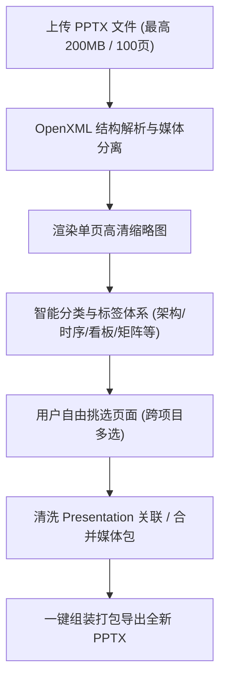
```mermaid
flowchart TD
    P1["上传 PPTX 文件 (最高 200MB / 100页)"] --> P2["OpenXML 结构解析与媒体分离"]
    P2 --> P3["渲染单页高清缩略图"]
    P3 --> P4["智能分类与标签体系 (架构/时序/看板/矩阵等)"]
    P4 --> P5["用户自由挑选页面 (跨项目多选)"]
    P5 --> P6["清洗 Presentation 关联 / 合并媒体包"]
    P6 --> P7["一键组装打包导出全新 PPTX"]
```

- **PPTX 智能拆解与解析 (`/api/slide-design`)**：
  - 支持上传最高 200MB 的 PPTX（单文件最多 100 页），深度解析底层 OpenXML，拆解单页 Slide、提取多媒体资源并自动渲染高清缩略图。
- **素材分类体系重组与标签复用**：
  - 建立统一的胶片素材库（架构图、时序图、数据看板、对比矩阵等），支持分类预览与标签复用检索。
- **页面自由挑选与打包重组**：
  - 用户多选所需单页后，服务端自动清洗 presentation 结构并组装打包为全新的标准 PPTX 文件。

---

### 2.6 专项治理工具链 (PR审计 / FRT / 需求广场 / 问卷调研)
- **PR 进展审计 (`/praudit`)**：
  - 审计级批量自检系统，检查 PR 进展附件记录是否完整合规，支持导入 Excel 校验并导出双语 PDF 报告。
- **FRT KPI 自动核算 (`/frt`)**：
  - 基于动态规则引擎，智能提取 SR 类型，多周期自动化核算 FRT KPI 达成率并诊断扣分项。
- **全民需求广场 (`/requirements`)**：
  - 平台需求全民提交入口，提供待评审 -> 评估中 -> 开发中 -> 已上线 -> 已驳回的可视化流转看板。
- **可配置问卷调研系统 (`/surveys`)**：
  - 自由定义调研表单字段，支持针对特定管理角色进行统计分析，收集提交并一键导出 Excel。

---

### 2.7 平台效能大盘、服务监控与友情链接
- **平台效能总览**：
  - 首页动态实时统计：已完成指标检查量、累计服务次数、等效人工工时、累计节约工时与效率提升百分比。
- **服务状态与链路追踪 (`/api/platform-metrics/service-status`)**：
  - 自动记录全量 API 响应码、耗时、IP、UA，保留 180 天异常失败日志，敏感字段全程脱敏。
- **友情链接与可用性自动探测 (`/api/friend-links`)**：
  - 首页友情链接矩阵，后台常驻定时探活服务，动态以“正常 (绿) / 告警 (黄) / 离线 (红)”展示健康状态。

---

### 2.8 自定义工具与内置工具同步生态

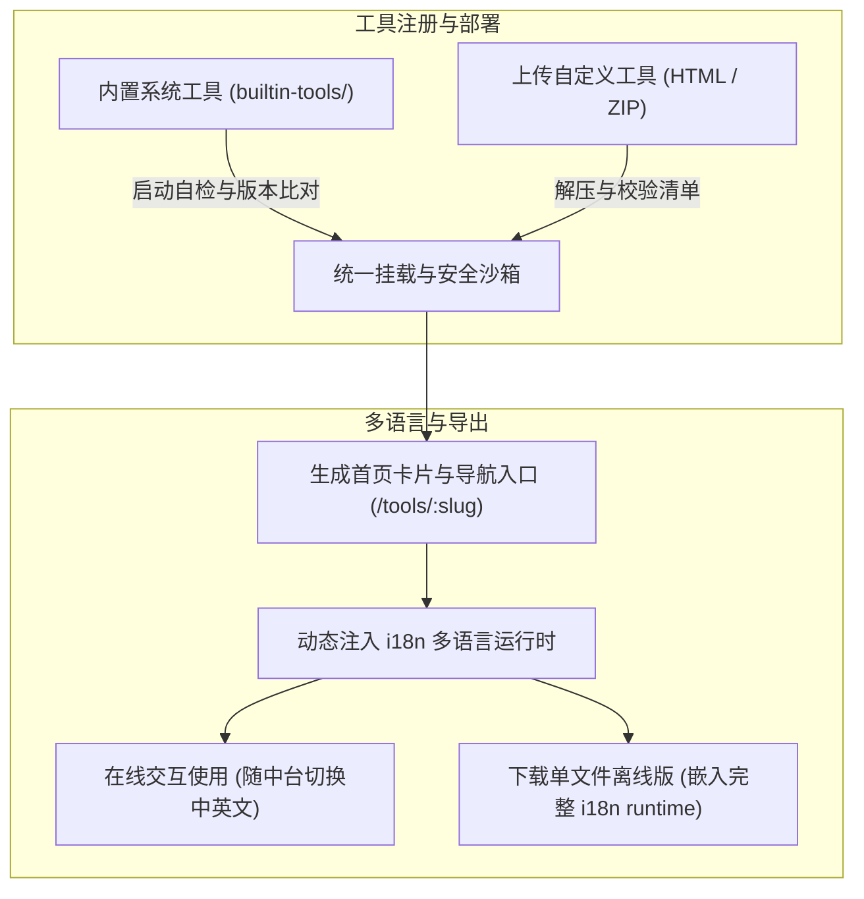
```mermaid
flowchart TD
    subgraph 工具接入["工具注册与部署"]
        T1["内置系统工具 (builtin-tools/)"] -->|启动自检与版本比对| T3["统一挂载与安全沙箱"]
        T2["上传自定义工具 (HTML / ZIP)"] -->|解压与校验清单| T3
    end
    subgraph 运行时与分发["多语言与导出"]
        T3 --> T4["生成首页卡片与导航入口 (/tools/:slug)"]
        T4 --> T5["动态注入 i18n 多语言运行时"]
        T5 --> T6["在线交互使用 (随中台切换中英文)"]
        T5 --> T7["下载单文件离线版 (嵌入完整 i18n runtime)"]
    end
```

- **自定义 HTML 工具 (`/custom-tools`)**：
  - 上传 HTML 或 ZIP 工具包后自动解压校验并挂载独立 URL (`/tools/:slug`)，生成首页卡片与导航。
- **内置系统工具自动同步 (`builtin-tools-sync.js`)**：
  - 服务启动时自动扫描 `backend/builtin-tools/`，对比哈希并自动安装缺失的系统工具。
- **多语言 (i18n) 运行时注入**：
  - 动态注入 `custom-tool-i18n-runtime.js`，支持单文件离线导出。

---

### 2.9 智能客服 AI 与 2D/3D 双视图知识图谱

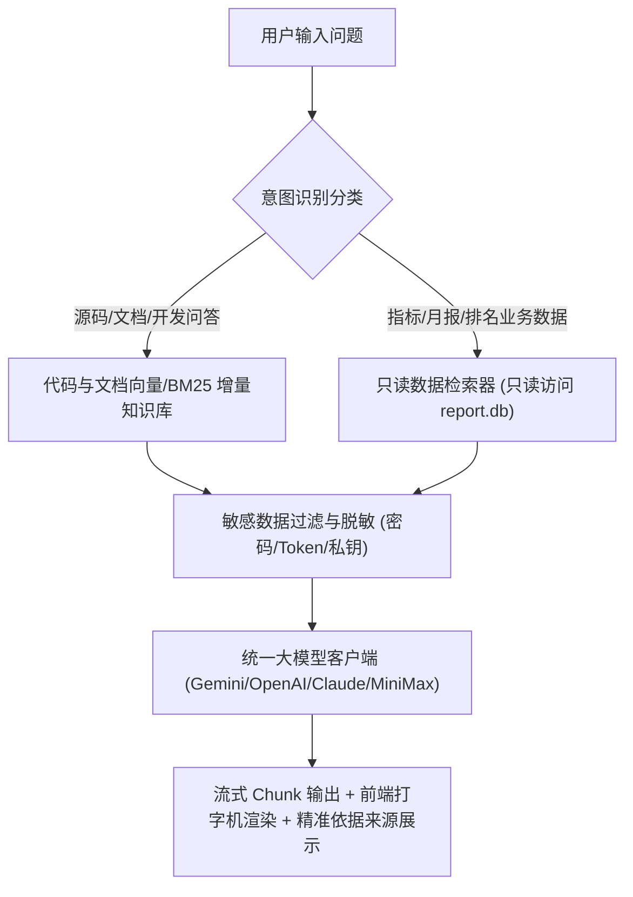
```mermaid
flowchart TD
    Q["用户输入问题"] --> INT{"意图识别分类"}
    INT -->|源码/文档/开发问答| K1["代码与文档向量/BM25 增量知识库"]
    INT -->|指标/月报/排名业务数据| K2["只读数据检索器 (只读访问 report.db)"]
    K1 --> SEC["敏感数据过滤与脱敏 (密码/Token/私钥)"]
    K2 --> SEC
    SEC --> LLM["统一大模型客户端 (Gemini/OpenAI/Claude/MiniMax)"]
    LLM --> OUT["流式 Chunk 输出 + 前端打字机渲染 + 精准依据来源展示"]
```

- **多模型提供商接入与流式体验**：
  - 原生适配 **Google Gemini、OpenAI / Azure OpenAI、Anthropic Claude、MiniMax** 以及兼容 OpenAI 接口规范的各大内外部大模型。
  - 后端通过 `ai-provider-client.js` 统一适配，支持真实的 Server-Sent Events / Chunk 流式输出与前端打字机渲染，支持用户中途主动中断生成。
  - 设置中心支持配置不同模型的 API Token、模型标识、系统提示词与输入/输出 Token 单价，前端对话实时显示 **Token 消耗量与成本费用估算**。

- **双引擎只读安全检索架构**：
  - **项目源码与文档增量知识库**：
    - 自动对 `README.md`、`docs/*.md`、前后端核心源码、UIV 脚本及自带/自定义 HTML 工具源码建立增量向量与 BM25 索引。
    - 回答底部附带“本次回答依据”卡片，严格区分“知识库规模”、“检索候选”与“实际引用”，仅将通过动态相关度门槛的片段作为证据，并精准展示文件相对路径、起始行号与代码片段。
  - **业务数据受限只读分析**：
    - 针对指标当前值、分月得分、客户群排名或扣分矩阵等业务问题，通过专用只读配置与数据检索器定向查询 `data/report.db` 快照数据，**严禁大模型执行自由 SQL 或进行任何业务数据写操作**。
    - 涉及历史月报分析时，严格读取历史入库当时保存的得分状态，不按当前规则重算旧数据。

- **2D / 3D 双视图智能知识图谱**：

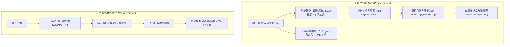
```mermaid
graph TD
    subgraph 视图一["1. 项目知识图谱 (Project Graph)"]
        R1["根节点 (Tools Platform)"] --> C1["功能分类 (数据抓取 / SLA / 报表 / 专项工具)"]
        C1 --> M1["业务工具与页面 (/sla, /report, /uivf12)"]
        M1 --> S1["源码依赖与服务路由 (routes/*.js, models/*.js)"]
        S1 --> T1["底层数据库与物理表 (tools.db, report.db)"]
        R1 --> C2["工具与数据资产分支 (自带/自定义 HTML 工具)"]
    end

    subgraph 视图二["2. 指标体系图谱 (Metrics Graph)"]
        R2["月份规则"] --> C3["指标分类 (风险/整改/CPT/SR等)"]
        C3 --> M2["核心指标 (达成率 / 超时率)"]
        M2 --> S2["子指标与考核明细"]
        S2 --> D2["历史快照穿透 (实际值 / 目标值 / 得分)"]
    end
```

  - **项目知识图谱分支与拓扑关联**：
    - 完整展现平台根节点、功能模块、页面入口、服务路由、代码文件与底层 SQLite 物理表的拓扑网络。
    - 包含独立的“工具与数据资产”分支，按“自带 HTML 工具 / 自定义 HTML 工具 / 数据库与表”层层展开。
    - 同一 HTML 工具下的 MP3 音频默认折叠为一个聚合节点，节点保留真实文件数量与总大小；代码对具体音频文件的依赖统一指向该节点，避免大量二进制资源节点拖慢 2D/3D 布局计算。
  - **智能层级渲染与碰撞避让**：
    - 标签文字按“根节点 → 分类 → 业务节点 → 文件/子指标”随缩放级别逐级出现，内置数量上限控制与标签碰撞避让算法。
    - **单节点聚焦与一跳高亮**：悬浮或点击节点时仅高亮其一跳直接邻居与关联线，避免根节点点亮整张图造成视觉干扰；单击后高亮锁定保留，支持悬浮临时预览其他节点关系。
  - **分层生长动画与外观/力导向控制面板**：
    - 支持按真实 `contains` 归属层级重播生长动画：根节点、分类、指标/工具、文件依次生长，归属线先展开、跨模块依赖线渐次绘制。
    - 提供外观与力导向实时控制面板：可调多种**空间主题配色**、节点尺寸、连线粗细、标签密度、动画速度、向心力、排斥力、连接吸引力、连线长度与漂浮阻尼，偏好实时保存在浏览器本地。
  - **3D 空间透视引擎与相机反投影拖拽**：
    - 顶部工具栏支持一键在 2D 平面图谱与 3D 空间透视视角间无缝切换。
    - **3D 景深与光照**：通过深度分层减少密集连线交叉，利用固定左上方柔和环境光呈现球体节点漫反射、小范围高光与景深衰减。
    - **3D 视角交互**：鼠标左键拖动空白处旋转视角，按住鼠标滚轮拖动平移视角，滚轮滚动缩放视角。
    - **相机反投影节点拖拽算法**：节点拖拽时，系统根据当前相机的水平角 (Yaw)、俯仰角 (Pitch) 和透视投影比例，将屏幕二维位移实时反投影为 3D 世界坐标，确保旋转任意视角后节点依然随鼠标同向位移，释放时沿当前相机视平面保留平滑物理惯性。
  - **指标体系图谱动态仿真**：
    - 按“月份规则 → 指标分类 → 核心指标 → 子指标”展示，支持月份动态切换与仿真推演；点击指标节点可穿透查看已保存的历史录入值、基线目标、扣分明细与达标状态。
  - **全局多语言实时联动**：
    - 智能客服与知识图谱深度订阅全局语言切换事件；顶部导航切换为英文后，客服界面、图谱节点、连线关系与 AI 默认回答语言均同步切换为英文。

---

## 3. 安全授权与双轨 License 体系

为了保证安装包与扩展在企业内网的安全合规分发，平台构建了严密的**双轨非对称加密授权体系**：

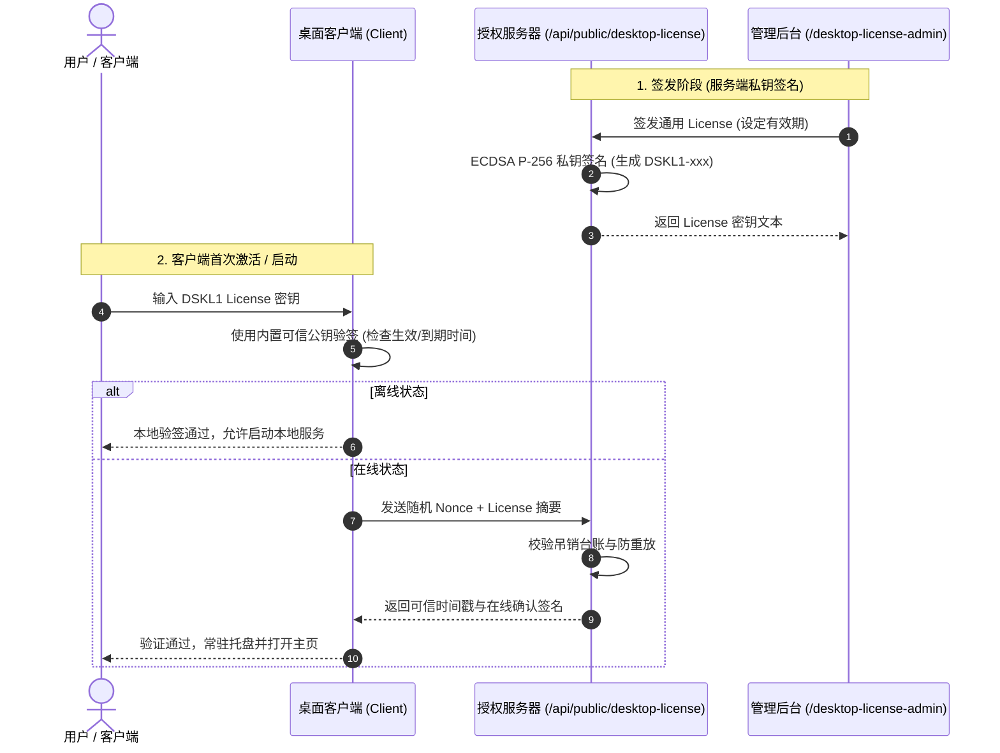
```mermaid
sequenceDiagram
    autonumber
    actor User as 用户 / 客户端
    participant Client as 桌面客户端 (Client)
    participant Server as 授权服务器 (/api/public/desktop-license)
    participant Admin as 管理后台 (/desktop-license-admin)

    Note over Admin,Server: 1. 签发阶段 (服务端私钥签名)
    Admin->>Server: 签发通用 License (设定有效期)
    Server->>Server: ECDSA P-256 私钥签名 (生成 DSKL1-xxx)
    Server-->>Admin: 返回 License 密钥文本

    Note over User,Client: 2. 客户端首次激活 / 启动
    User->>Client: 输入 DSKL1 License 密钥
    Client->>Client: 使用内置可信公钥验签 (检查生效/到期时间)
    alt 离线状态
        Client-->>User: 本地验签通过，允许启动本地服务
    else 在线状态
        Client->>Server: 发送随机 Nonce + License 摘要
        Server->>Server: 校验吊销台账与防重放
        Server-->>Client: 返回可信时间戳与在线确认签名
        Client-->>User: 验证通过，常驻托盘并打开主页
    end
```

### 3.1 核心授权机制与安全设计
1. **ECDSA P-256 算法**：采用行业标准椭圆曲线数字签名算法，签名内容包含产品标识、生效时间与精确到期时间戳。
2. **离线高可用**：客户端内置公钥配置 (`frontend/desktop-license-client-config.json`)，即使完全无外网也能永久在有效期内核验合法性。
3. **打包安全隔离**：
   - 签发权威私钥 (`desktop-license-signing-key.json`)、授权台账 (`desktop-license-registry.json`)、管理员签发路由与管理页面，**在 electron-builder 打包配置中被严格排除 (`!backend/...`)**，绝不随客户端分发。
4. **F12 浏览器扩展 License**：
   - 针对浏览器扩展提供独立公钥验签与打包接口 (`/api/public/f12-license`)。

---

### 3.2 企业级安全基线与全链路数据脱敏

平台严格遵循企业级内网安全规范与数据隐私保护原则：

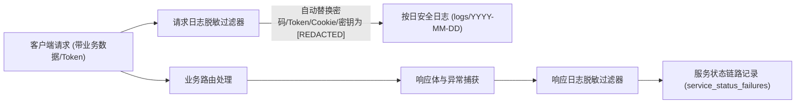
```mermaid
flowchart LR
    REQ["客户端请求 (带业务数据/Token)"] --> REDACT["请求日志脱敏过滤器"]
    REDACT -->|"自动替换密码/Token/Cookie/密钥为 [REDACTED]"| LOG["按日安全日志 (logs/YYYY-MM-DD)"]
    REQ --> HANDLER["业务路由处理"]
    HANDLER --> RESP["响应体与异常捕获"]
    RESP --> REDACT2["响应日志脱敏过滤器"]
    REDACT2 --> DB_LOG["服务状态链路记录 (service_status_failures)"]
```

1. **全链路动态脱敏过滤器 (`sanitizeOriginalUrl` / `redactForLog`)**：
   - 无论是控制台输出、按日应用日志，还是失败链路追踪库 (`service_status_failures`)，系统均自动拦截并脱敏所有敏感字段。
   - 脱敏匹配键集合：`authorization`, `password`, `token`, `access_token`, `refresh_token`, `api_key`, `apikey`, `secret` 等；URL query 参数与 JSON 深度嵌套对象全程递归脱敏为 `[REDACTED]`。
2. **多层级访问控制与静态资源保护 (`shouldProtectHtmlEntry`)**：
   - 业务 HTML 页面全部受 JWT Session 强校验保护，未登录拦截重定向至登录页，防止退出登录后页面因浏览器缓存闪现。
   - 公开资源白名单严格受限：仅限登录页、隐私声明、服务条款及非敏感静态资源 (`.css`, `.js`, `.png`, `.ico`)。
   - 自定义 HTML 工具按 `publicAccess` 字段实施细粒度权限隔离，支持管理员灵活开放免密公开访问或强制登录访问。
3. **数据隐私驻留合规 (Data Privacy by Design)**：
   - 平台采用纯本地/私有化部署架构，所有业务指标、快照数据与分析结论完全驻留于企业内网数据库，绝不向任何外部第三方服务器外发原始数据。

---

## 4. 数据存储、启动自愈与迁移治理

### 4.1 物理存储分布与职责

| 数据库 / 存储文件 | 宿主目录 | 存储内容与核心表 |
| :--- | :--- | :--- |
| **`tools.db`** | `backend/data/` | 账号鉴权 (`users`, `sessions`)、UIV 脚本仓库 (`uiv_categories`, `uiv_scripts`)、SLA 规则配置 (`sla_targets`, `sla_prefs`, `sla_groups`, `sla_snapshots`)、FRT 规则、PR 审计配置、告警事件 (`alert_events`)、服务状态指标等 |
| **`report.db`** | `data/` | 报表看板入库历史快照、各代表处/客户群月度得分、全量指标计算明细数据、月报读取主库 |
| **`requirements.db`** | `data/` | 需求广场提议记录 (`requirements`)、需求流转状态变更日志与评论 |
| **`ai-knowledge.db`** | `backend/data/` | AI 客服代码与项目文档增量向量/BM25 索引缓存（可随源码更新随时重建） |
| **`custom-tools/`** | `backend/data/` | 所有上传的自定义 HTML 工具与静态资源文件 |
| **`images/`** | `data/` | 报表全屏高清截图、导出 Excel/PDF 临时缓存文件 |

### 4.2 启动期完整性自检与自愈 (`sqlite-integrity-repair.js`)

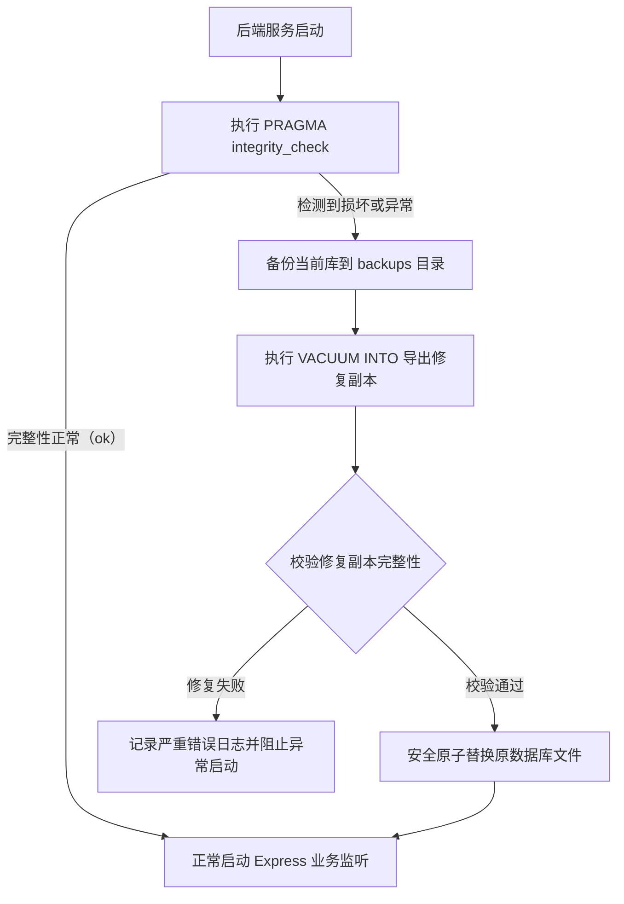
```mermaid
flowchart TD
    START["后端服务启动"] --> CHK["执行 PRAGMA integrity_check"]
    CHK -->|"完整性正常（ok）"| RUN["正常启动 Express 业务监听"]
    CHK -->|"检测到损坏或异常"| BAK["备份当前库到 backups 目录"]
    BAK --> VAC["执行 VACUUM INTO 导出修复副本"]
    VAC --> VERIFY{"校验修复副本完整性"}
    VERIFY -->|"校验通过"| SWAP["安全原子替换原数据库文件"]
    SWAP --> RUN
    VERIFY -->|"修复失败"| ERR["记录严重错误日志并阻止异常启动"]
```

### 4.3 配置变更指纹监控 (`config-change-monitor.js`)
- 后台常驻定时计算 SLA 指标规则、分月目标、权重与表格偏好的 SHA-256 结构指纹。
- 当检测到指标规则异常减少、目标被外部修改时，自动向**系统告警中心**投递 Warning 级别告警，并记录变更前后差异与请求来源。

### 4.4 存储迁移治理台 (`/storage`)
- 提供从历史 JSON 配置向 SQLite 数据库迁移的全程可视化状态台。
- 支持实时执行 **Parity 一致性校验**，精准比对 JSON 与 SQLite 中的数据条数与内容差异；确认迁移无损后，支持管理员一键安全清理遗留 JSON 文件。

### 4.5 核心数据库物理表 Schema 字典

平台采用领域驱动划分 SQLite 数据库边界，主要核心物理表设计如下：

#### 1. `backend/data/tools.db` (中台核心配置与运行库)
| 表名 | 核心字段 | 业务用途与说明 |
| :--- | :--- | :--- |
| `users` | `username` (PK), `password_hash`, `role`, `created_at` | 用户身份认证、哈希密码存储与角色权限 |
| `sessions` | `token` (PK), `username`, `expires_at`, `created_at` | 登录态 Session 凭据管理 |
| `uiv_categories` | `id` (PK), `name`, `icon`, `sort_order` | UIVF12 抓取脚本分类体系 |
| `uiv_scripts` | `id` (PK), `category_id`, `name`, `code`, `console_code`, `payload` | UI.Vision 宏与 F12 抓取脚本实体与版本 |
| `sla_targets` | `metric_key` (PK), `target_json`, `weight`, `updated_at` | SLA 各指标 1~12 月基线目标与权重配置 |
| `sla_prefs` | `pref_key` (PK), `pref_json`, `updated_at` | 每张表的显示列、排序、冻结列与计算模式偏好 |
| `sla_groups` | `id` (PK), `name`, `metrics_json`, `sort_order` | 指标大类与分组聚合配置 |
| `sla_snapshots` | `id` (PK), `month`, `snapshot_name`, `data_json`, `created_at` | SLA 上传与计算的历史快照沉淀 |
| `alert_events` | `id` (PK), `event_type`, `severity`, `status`, `title`, `message`, `detail_json` | 系统告警事件、AI 诊断建议回填与流转记录 |
| `service_status_daily` | `service_key`, `status_date` (PK), `request_count`, `success_count`, `duration_ms` | 平台 API 服务可用性与耗时统计日聚合表 |
| `service_status_failures` | `id` (PK), `service_key`, `request_at`, `method`, `path`, `status_code`, `detail` | 4xx/5xx 异常链路追踪明细（自动脱敏） |
| `config_fingerprints` | `scope` (PK), `hash`, `summary_json`, `updated_at` | 核心配置 SHA-256 指纹监控基准表 |

#### 2. `data/report.db` (报表看板与月报分析库)
| 表名 | 核心字段 | 业务用途与说明 |
| :--- | :--- | :--- |
| `PlatformConfig` | `key` (PK), `value_json`, `updated_at` | 月报中英文标题、看板全局参数等中台配置 |
| `snapshots` | `id` (PK), `month`, `snapshot_name`, `summary_json`, `created_at` | 月度质量入库基准快照 |
| `metrics_data` | `snapshot_id`, `rep_office`, `customer_group`, `metric_key`, `score` | 客户群各维度指标计算得分与扣分明细 |

#### 3. `data/requirements.db` (需求广场与协作流转库)
| 表名 | 核心字段 | 业务用途与说明 |
| :--- | :--- | :--- |
| `requirements` | `id` (PK), `title`, `description`, `status`, `submitter`, `created_at` | 全民需求提议与流转状态 |
| `requirement_logs` | `id` (PK), `requirement_id`, `actor`, `action`, `comment`, `created_at` | 需求评审、评估、开发与上线审计留痕 |

---

## 5. 备份恢复与远端主站同步

### 5.1 当前租户核心数据备份 (`/api/global-backup`)

接口名称中的 `global-backup` 是租户功能上线前保留的历史名称；在租户模式下，它表示**当前租户的核心业务数据备份**，不是整台服务器所有租户的一键归档。

| 操作 | 实际范围 | 对其他租户的影响 |
|---|---|---|
| 生成服务器备份 / 生成并下载 | 当前 Session 所在租户的 SQLite、JSON 配置、自定义工具和核心运行数据 | 不读取其他租户目录 |
| 定时备份 | 每个启用租户独立保存时间、保留周期、最近状态和备份目录 | 各租户分别调度、分别清理历史包 |
| 从服务器备份恢复 | 默认列表属于当前租户；如人工放入了不同 ID 的包，也执行来源/目标二次确认 | 只替换当前目标租户，不替换其他租户目录 |
| 上传 ZIP 恢复 | 同 `tenantId` 直接恢复；不同 ID 先返回 `409` 并展示来源/目标，管理员二次确认后可强制恢复 | 首次拦截不修改数据；确认后也只覆盖当前目标租户 |
| 恢复默认租户 | 恢复默认租户业务数据，但重新写回恢复前的账号、Session 和租户登记表 | `data/tenants/` 原样保留，其他租户仍可访问 |

- **备份清单**：`manifest.json` 明确记录 `scope: "single-tenant"`、稳定的 `tenantId`、创建时的 `tenantName`、`includesAllTenants: false`、文件数量、大小和数据目标。
- **恢复前保护**：正式替换前自动生成当前租户的 `pre-restore` 安全备份，并校验 ZIP 类型、版本、路径和租户身份。
- **跨租户确认**：租户 ID 不同会先安全停止，前端使用平台自定义弹窗同时展示“当前目标租户（名称 + ID）”和“备份来源租户（名称 + ID）”。只有管理员点击“确认强制恢复”后才携带 `forceCrossTenant` 重新发起恢复。
- **自动备份调度**：`globalBackupRepo.startAutoBackupScheduler()` 会遍历启用租户，为每个租户建立独立定时器；过期清理仅删除该租户的自动备份。
- **租户级容量上限**：可在 **全局设置 → 备份恢复 → 定时备份** 设置当前租户备份 ZIP 的总容量上限，默认 `10 GB`，支持 `0.1 GB` 起的小数。保存设置、服务启动以及每次生成备份后都会检查容量；超限时按修改时间从旧到新清理所有类型的旧备份，保护本次新包并至少保留一个最新恢复点。若最新单包本身超过上限，界面会明确显示仍然超限。
- **轻量包排除项**：`images/`、`slide-library/`、内部 `backups/`、`tmp/`、`quarantine/`、租户运行状态、`chat-history.db` 及其 WAL/SHM 边车文件和机器级 License 文件不进入 ZIP，恢复时保留目标服务器现有副本。这样可避免把历史备份再次装进新备份，也不会因未清理的胶片导入临时文件让日常包异常膨胀；该功能不等同于整机文件镜像。
- **目标租户双重校验**：恢复请求会显式携带页面显示的目标租户 ID，后端再与鉴权 Session 中的租户 ID 比较，并使用该 ID 重新建立恢复上下文。页面与 Session 不一致时返回 `409 ACTIVE_TENANT_CHANGED`，不会查找备份、关闭数据库或改写任何租户。

#### 如何备份全部租户

当前界面没有“一键恢复全部租户”的高风险操作。需要整机迁移或灾难恢复时，应先停止 Tools Platform 服务，再对以下路径做一次离线整体归档：

- 默认租户及全局控制面：`backend/data/`（或 `TOOLS_DATA_DIR`）；
- 新租户目录：`backend/data/tenants/`；
- 分离部署的报表目录：`data/`（或 `TOOLS_REPORT_DATA_DIR`）；
- 默认租户大素材：实际部署中的 `images/`、`slide-library/`；
- 机器级远端连接配置：`backend/runtime/remote_backup_sync_settings.json`。

整机恢复时应在服务停止状态下整体恢复上述目录，不能把某个租户 ZIP 当作全租户镜像。日常误操作恢复则优先使用界面中的当前租户备份，影响范围更小。

### 5.2 远端主站自动同步 (`remote-backup-sync-repository.js`)
- **同租户映射**：远端自动同步按稳定 ID 映射，而不是按显示名称。本地 ID `acme` 只读取远端 ID `acme`，两边名称不同不影响同步；系统先登录远端，再调用租户切换接口，切换失败就终止同步。
- **配置与状态边界**：远端域名和凭据属于机器级运维配置，不写入租户备份包；最近检查、最近恢复和下载临时文件按租户隔离，避免不同租户互相误判“已同步”。
- **启动自动恢复**：当前只对 `default` 租户开放，避免一个进程启动时连续恢复多个 SQLite 工作区。其他租户可在切换后手动执行“测试连接/检查最新”或“按规则拉取恢复”。
- **适用场景**：用于同一套租户结构的主站与分站/Windows 本地节点同步。远端与本地应预先创建相同租户 ID；系统不会根据相似名称猜测租户，也不会自动创建远端租户。如果确实需要把不同 ID 的远端租户复制到本地，应先下载其备份包，再在目标租户使用“上传备份包恢复”，核对弹窗后强制恢复。

---

## 6. 高可用设计、性能基准与全链路可观测性

平台为工业级稳定运行设计了全方位的韧性架构与可观测性体系：

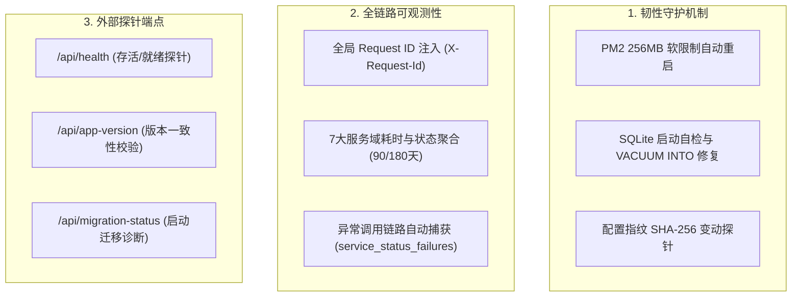
```mermaid
flowchart TD
    subgraph 韧性守护["1. 韧性守护机制"]
        H1["PM2 256MB 软限制自动重启"]
        H2["SQLite 启动自检与 VACUUM INTO 修复"]
        H3["配置指纹 SHA-256 变动探针"]
    end

    subgraph 链路追踪["2. 全链路可观测性"]
        O1["全局 Request ID 注入 (X-Request-Id)"]
        O2["7大服务域耗时与状态聚合 (90/180天)"]
        O3["异常调用链路自动捕获 (service_status_failures)"]
    end

    subgraph 探针体系["3. 外部探针端点"]
        P1["/api/health (存活/就绪探针)"]
        P2["/api/app-version (版本一致性校验)"]
        P3["/api/migration-status (启动迁移诊断)"]
    end
```

### 6.1 性能基准与高并发设计
1. **轻量毫秒级响应**：
   - 前端采用原生 HTML/JS 静态分发，无 SSR 构建开销；后端路由经过深度优化，常规 API 平均响应时间控制在 **< 15ms**。
2. **SQLite WAL 高性能读写**：
   - 数据库全面启用 WAL (Write-Ahead Logging) 模式，实现高并发场景下“读写互不阻塞”，单库轻松支撑百级运维并发吞吐。
3. **内存与连接池自动回收**：
   - Node.js 内存占用通过 PM2 设置 256MB 软限制自动平滑重启；数据库操作采用受控连接生命周期与自动关闭机制，杜绝连接泄露。

### 6.2 全链路追踪与健康探针体系
1. **统一链路追踪 ID (`X-Request-Id`)**：
   - 每个进入系统的 HTTP 请求自动分配全局唯一 `requestId`（如 `req_m7x9k2_a1b2c3d4`），在响应头和日志中全程透传，便于多系统日志联合排障。
2. **7 大服务域健康监控 (`service-status-repository`)**：
   - 自动将 API 划分为 `core` (平台核心)、`auth` (账号授权)、`automation` (抓取自动化)、`data` (数据报表)、`ai` (AI服务)、`tools` (自定义工具)、`operations` (运维告警) 七大域，按天统计请求量、成功率、P99/平均耗时。
3. **标准运维探针端点**：
   - **`/api/health`**：标准健康检查接口，用于 Kubernetes Liveness/Readiness 探针或 Nginx upstream 健康检查。
   - **`/api/app-version`**：免鉴权读取版本号，用于桌面端与集群多节点版本一致性对比。
   - **`/api/migration-status`**：免鉴权获取数据自检与 JSON $\rightarrow$ SQLite 迁移诊断报告。

---

## 7. 常用页面入口清单

默认服务端口为 `3030`。

| 页面名称 | 访问路径 | 访问权限 | 核心功能与业务场景 |
| :--- | :--- | :--- | :--- |
| **首页大中台** | `/` | 需登录 | 平台主入口、效能大盘、工具卡片矩阵、友情链接、知识图谱入口 |
| **登录页** | `/login.html` | 公开 | 用户账号密码登录，支持弹窗查看隐私政策与服务条款 |
| **数据抓取** | `/uivf12` | 需登录 | UIVF12 脚本仓库、UI.Vision 批量调度与 F12 抓取控制台 |
| **数据导入** | `/sla` | 需登录 (修改需Admin) | SLA 多表数据合并、列映射、指标规则管理与历史快照上传 |
| **报表看板** | `/report` | 需登录 | 客户群健康度排名、比例计分、入库计算、短板透视矩阵 |
| **月报页面** | `/monthly` | 需登录 | 跨月历史指标演进趋势比对、同比环比分析、月度质量报告归档 |
| **一键催办** | `/expedite` | 需登录 | 基于快照自动生成催办跟例文案、全屏长截图与 Excel 导出 |
| **大屏看板** | `/bigscreen` | 需登录 | 全屏运营态势驾驶舱、短板风险分布、雷达巡检 |
| **PR 审计** | `/praudit` | 需登录 | PR 进展附件审计、Excel 导入校验与双语 PDF 报告导出 |
| **FRT 核算** | `/frt` | 需登录 | FRT 动态规则引擎与 KPI 自动化核算平台 |
| **需求广场** | `/requirements`| 需登录 | 平台功能需求提议、流转状态看板与评论日志追踪 |
| **存储迁移** | `/storage` | 需登录 (修改需Admin) | SQLite/JSON 迁移进度核对、数据一致性 Parity 校验与安全清理 |
| **数据探索** | `/db-explorer` | 需登录 (修改需Admin) | SQLite 底层物理表可视化查询与多日日志打包导出 |
| **自定义工具** | `/custom-tool` / `/tools/:slug` | 按工具配置 | 运行与管理自定义 HTML/ZIP 工具 |
| **License 管理** | `/desktop-license-admin` | 管理员专有 | 管理员签发、续期、失效与归档客户端 License（服务端专有） |
| **合规与隐私** | `/privacy`, `/terms` | 公开 | 平台合规静态说明页，支持独立或弹窗访问 |

---

## 8. 主要 API 路由全景表

平台后端由多个高内聚业务路由模块构成：

| 路由前缀 | 对应文件 | 鉴权要求 | 核心职责与接口描述 |
| :--- | :--- | :--- | :--- |
| `/api/auth` | `auth.js` | 部分公开 | 用户登录、退出、Session 状态校验、修改密码与账号管理 |
| `/api/tenants` | `tenants.js` | 需登录（管理写操作需 Admin） | 当前 Session 的租户清单与切换，以及租户新增、编辑和安全归档 |
| `/api/nav-settings` | `nav-settings.js` | 需登录 (写需Admin) | 顶部导航栏配置、分类及菜单显隐排序 |
| `/api/ai-settings` | `ai-settings.js` | 需登录 (写需Admin) | 智能客服模型提供商 (Gemini/OpenAI/Claude/MiniMax)、Token 与提示词配置 |
| `/api/ai` | `ai.js` | 需登录 | 流式聊天对话、代码/文档增量知识库检索、只读报表分析、知识图谱数据 |
| `/api/uiv` | `uiv.js` | 需登录 (写需Admin) | UIVF12 脚本仓库 CRUD 与 UI.Vision Macro 临时 runner 调度 |
| `/api/uiv-ai-adapter` | `uiv-ai-adapter.js` | 需登录 (写需Admin) | 目标站点抓取请求 AST 分析与 AI 规则自动推断 |
| `/api/uiv-auto-import` | `uiv-auto-import.js`| 需登录 | 抓取后自动导入的结构化 rows 临时桥接会话 |
| `/api/sla` | `sla.js` | 需登录 (写需Admin) | SLA 指标规则、分月目标、列映射偏好、合并入库与快照管理 |
| `/api/upload` | `upload.js` | 需登录 | 上传文件历史记录与临时附件处理 |
| `/api/db` | `db.js` | 需登录 (写需Admin) | 报表看板计算、客户群得分、月报指标读取与配置存储 |
| `/api/external/metrics`| `external-metrics.js` | 需登录/Token | 面向移动端 (iOS/KMP) 和外部系统的只读指标 OpenAPI |
| `/api/praudit` | `praudit.js` | 需登录 (写需Admin) | PR 进展审计规则配置、抽查数据校验与 PDF 报告生成 |
| `/api/chat-history` | `chat-history.js` | 需登录（导入/删除需 Admin） | 递归 TXT 导入、会话浏览、全文检索、个人收藏/已读状态及人员统计 |
| `/api/frt` | `frt.js` | 需登录 (写需Admin) | FRT 动态核算规则配置与 KPI 历史快照计算 |
| `/api/requirements` | `requirements.js` | 需登录 | 需求广场提议发布、流转状态变更与评论日志 |
| `/api/slide-design` | `slide-design.js` | 需登录 | PPTX 胶片拆解、缩略图渲染、分类重组、标签复用与重组打包导出 |
| `/api/surveys` | `surveys.js` | 需登录 (写需Admin) | 可配置问卷调研模板维护、提交记录与 Excel 导出 |
| `/api/alert-center` | `alert-center.js` | 需登录 (写需Admin) | 系统告警事件列表、状态标记与 AI 智能告警分析回填 |
| `/api/platform-metrics`| `platform-metrics.js`| 需登录 | 首页效能大盘统计指标与 API 服务请求状态监控追踪 |
| `/api/friend-links` | `friend-links.js` | 需登录 (写需Admin) | 首页友情链接维护与后台定时可用性探活 |
| `/api/onboarding` | `onboarding.js` | 需登录 (写需Admin) | 首次启动默认内容预览/决策、从全局设置重新补齐默认内容，以及带安全备份与完整归档的程序数据初始化 |
| `/api/custom-tools` | `custom-tools.js` | 需登录 (写需Admin) | 自定义 HTML/ZIP 工具上传、状态恢复与内置工具同步 |
| `/api/global-backup` | `global-backup.js` | 需登录 (写需Admin) | 当前租户核心数据备份包生成、租户级自动备份调度与同租户恢复 |
| `/api/storage` | `storage.js` | 需登录 (写需Admin) | SQLite/JSON 存储迁移状态、读源切换与遗留 JSON 安全清理 |
| `/api/db-explorer` | `db-explorer.js` | 需登录 (写需Admin) | SQLite 物理表结构查询、数据探针与日志文件打包下载 |
| `/api/desktop-license` | `desktop-license-local.js` | 需登录 | 桌面客户端本地 License 授权状态检查 |
| `/api/public/desktop-license` | `desktop-license-public.js` | 公开 | 桌面端 License 激活、心跳验签与离线凭据签发 |
| `/api/public/f12-license` | `f12-license-public.js` | 公开 | F12 浏览器扩展 License 验签、可信时间与打包服务 |
| `/api/desktop-licenses` | `desktop-license-admin.js` | 管理员专有 | 管理员专用：桌面 License 签发、续期、吊销与台账管理 |

---

## 9. 移动端生态 (iOS / KMP)

平台在 `tools-platform/iosapp/` 提供了配套的移动端工程，实现多端协同：
- **工程架构**：基于 **Kotlin Multiplatform (KMP)** + **Compose Multiplatform** 构建跨平台共享逻辑，包含 iOS 原生 Xcode 工程包装。
- **数据对接**：移动端直接调用后端的 `/api/external/metrics` 只读接口，支持随时随地在 iPhone/iPad 上查看：
  - 各代表处/客户群月度排名与得分变化。
  - 重点短板指标与未达标项。
  - SLA 预警与大屏关键态势数据。

---

## 10. 目录结构详解

```text
privacy-policy/
├── README.md                              # 根目录索引导航与快捷入口
└── tools-platform/                        # 中台主工程根目录
    ├── package.json                       # Electron 桌面端打包与根构建配置
    ├── electron-main.js                   # Windows 桌面托盘壳主进程
    ├── electron-preload.js                # 桌面端 IPC 与日志桥接脚本
    ├── desktop-license-client.js          # 桌面端 License 离线/在线验签客户端
    ├── desktop-license-preload.js         # License 激活页面预加载脚本
    │
    ├── backend/                           # Express 后端核心服务
    │   ├── server.js                      # 后端服务主入口、中间件装配、自检与后台任务调度
    │   ├── preflight.js                   # 启动前端口与系统环境预检
    │   ├── ecosystem.config.js            # PM2 生产运维配置文件
    │   ├── package.json                   # 后端依赖配置
    │   ├── routes/                        # 27 个业务 API 路由模块
    │   ├── models/                        # 数据库仓储 (app-db, report-store)、业务引擎与 AI 适配器
    │   ├── middleware/                    # JWT 鉴权与管理员权限控制中间件
    │   ├── logger/                        # 日志按日轮转与格式化输出
    │   ├── builtin-tools/                 # 系统内置标准 HTML 工具包 (启动自动同步)
    │   └── data/                          # 后端运行数据库与配置 (tools.db, ai-knowledge.db 等)
    │
    ├── frontend/                          # 原生多页面静态前端
    │   ├── index.html                     # 首页大中台主页面
    │   ├── pages/                         # 各独立业务页面 (uivf12, sla, report, monthly 等)
    │   ├── css/                           # 全局样式、设计系统与暗黑主题
    │   ├── js/                            # 前端业务逻辑
    │   │   ├── shared/                    # 公共组件 (navbar, api, ai-assistant, 2D/3D知识图谱等)
    │   │   ├── uivf12/                    # 抓取脚本工程业务代码
    │   │   ├── sla/                       # SLA 导入与规则引擎
    │   │   └── report/                    # 报表看板与月报交互
    │   └── assets/                        # 图标、免安装 Splash 与静态资源
    │
    ├── data/                              # 业务数据主目录 (report.db, requirements.db, images/ 等)
    ├── docs/                              # 专项开发与 API 文档
    │   ├── external-metrics-api.md        # 外部指标 OpenAPI 调用文档
    │   └── tools-platform-feature-overview-bilingual.html # 中英双语全景特性文档
    ├── iosapp/                            # 配套 iOS / Kotlin Multiplatform 移动端工程
    ├── scripts/                           # 运维、License 密钥同步与构建辅助脚本
    └── tests/                             # 自动化单元测试与集成测试
```

---

## 11. 环境变量与配置字典

后端支持通过环境变量进行灵活定制与容器化部署：

| 环境变量名 | 默认值 | 说明与取值范围 |
| :--- | :--- | :--- |
| `PORT` | `3030` | HTTP 服务监听端口 |
| `TOOLS_DATA_DIR` | `backend/data/` | 后端核心数据存储目录（桌面版自动重定向至系统用户数据目录） |
| `REPORT_DATA_DIR` | `data/` | 报表核心数据存储目录 (`report.db`) |
| `SLIDE_IMPORT_MAX_MB` | `200` | PPTX 胶片包上传大小上限（单位：MB，支持 10~2048） |
| `TOOLS_DAILY_LOGS` | `1` (生产) / `0` (桌面) | 是否开启按日归档日志写入 |
| `TOOLS_DESKTOP_RUNTIME` | `0` | 是否处于 Windows Electron 桌面壳运行时环境 |
| `GEMINI_API_KEY` | - | Google Gemini AI 默认 API Key（设置中心配置优先于此变量） |
| `NODE_ENV` | `development` | 运行环境（`production` / `development`） |

---

## 12. 多系统部署、Windows 客户端与新手配置指引

### 12.1 跨操作系统基础环境准备

推荐运行环境为 **Node.js 20 LTS** 与 **npm 9+**。

#### 1. Linux (Ubuntu / Debian / CentOS / RHEL) 部署
```bash
# 1. 安装 Node.js 20 LTS (以 Ubuntu 为例)
curl -fsSL https://deb.nodesource.com/setup_20.x | sudo -E bash -
sudo apt-get install -y nodejs build-essential

# 2. 拉取代码并安装后端依赖
cd /opt/tools-platform/backend
npm install --production

# 3. 运行环境与启动自检
npm run doctor

# 4. 独立启动 (默认 3030 端口)
PORT=3030 npm start
```

#### 2. macOS 部署
```bash
# 1. 推荐使用 nvm 或 brew 安装 Node 20
brew install node@20
brew link node@20

# 2. 安装依赖并启动
cd tools-platform/backend
npm install
npm run doctor
npm start
```

#### 3. Windows (Node.js 原生运行)
```powershell
# 1. 确保安装 Visual Studio Build Tools (勾选 Desktop development with C++)
# 2. 在 PowerShell 中进入后端目录安装依赖并启动
cd tools-platform\backend
npm install
npm run doctor

# 指定端口启动
$env:PORT=3030; npm start
```

---

### 12.2 生产环境 PM2 常驻部署指引

生产服务器强烈建议使用 **PM2** 进行进程守护、自动重启与集群监控。

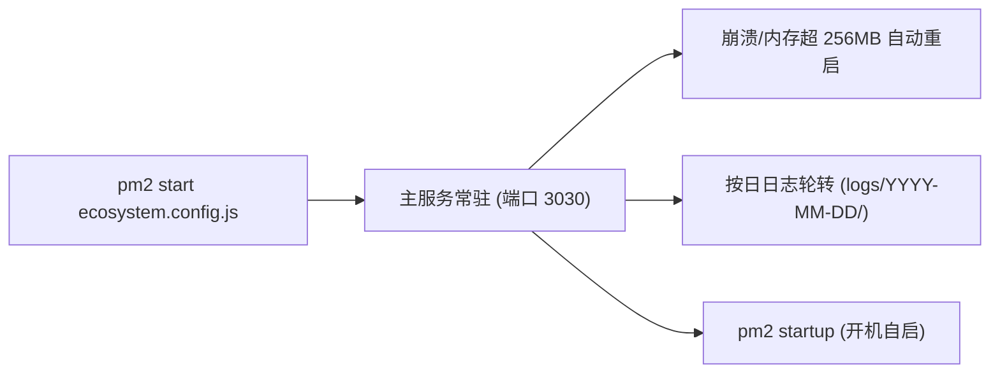
```mermaid
flowchart LR
    M1["pm2 start ecosystem.config.js"] --> M2["主服务常驻 (端口 3030)"]
    M2 --> M3["崩溃/内存超 256MB 自动重启"]
    M2 --> M4["按日日志轮转 (logs/YYYY-MM-DD/)"]
    M2 --> M5["pm2 startup (开机自启)"]
```

#### 1. 安装与初始化 PM2
```bash
npm install -g pm2
cd tools-platform/backend
```

#### 2. `ecosystem.config.js` 核心配置解析
```javascript
module.exports = {
  apps: [{
    name: 'tools-platform',
    script: './server.js',
    instances: 1,
    autorestart: true,
    max_memory_restart: '256M', // 内存超过 256MB 自动平滑重启
    env: {
      NODE_ENV: 'production',
      PORT: 3030
    },
    error_file: './logs/error.log',
    out_file: './logs/out.log',
    time: true
  }]
};
```

#### 3. 常用 PM2 运维命令
```bash
pm2 start ecosystem.config.js   # 启动服务
pm2 save                        # 保存当前进程列表
pm2 startup                     # 生成并配置操作系统开机自启脚本
pm2 status                      # 查看服务状态、CPU与内存占用
pm2 logs tools-platform         # 实时跟踪输出日志
pm2 restart tools-platform      # 平滑重启服务
pm2 stop tools-platform         # 停止服务
```

---

### 12.3 Windows 桌面客户端指引 (安装版 vs 绿色版)

平台通过 GitHub Actions 自动构建并发布两种 Windows 客户端：

| 特性维度 | NSIS 安装版 (`Setup.exe`) | 绿色免安装版 (`Portable.exe`) |
| :--- | :--- | :--- |
| **文件名格式** | `Tools-Platform-Setup-X.Y.Z.exe` | `Tools-Platform-Portable-X.Y.Z.exe` |
| **安装方式** | 标准 Windows 安装向导，可自定义安装路径 | 单文件 EXE，双击直接运行，无需安装 |
| **快捷方式** | 自动创建桌面与开始菜单快捷方式 | 不创建快捷方式，可手动发送快捷方式到桌面 |
| **版本升级** | **支持应用内检测更新与静默自动升级** | 需从 GitHub Releases 手动下载新 EXE 替换 |
| **开机自启** | 托盘菜单可直接一键勾选开机自启动 | 不写注册表启动项，纯绿色便携 |
| **数据存储** | 共用当前用户数据目录 (`%APPDATA%/tools-platform/data`) | 共用相同用户数据目录，更换 EXE **数据不丢失** |
| **使用场景** | **推荐主力办公机安装使用** | 临时调试、U盘便携、无管理员安装权限机器 |

#### 客户端获取与激活步骤：
1. **下载客户端**：从 GitHub Releases 下载最新的 `Tools-Platform-Setup-X.Y.Z.exe` 或 `Tools-Platform-Portable-X.Y.Z.exe`。
2. **首次启动激活**：
   - 首次双击打开程序，将弹出 License 激活窗口。
   - 输入管理员分配的通用授权码（以 `DSKL1-` 开头）。
   - 客户端核验成功后，将在后台自动拉起本地服务并在右下角系统托盘常驻。
3. **打开主页**：双击托盘图标，程序将自动调用系统默认浏览器打开 `http://localhost:3030`。

---

### 12.4 Windows 客户端本地生成文件与目录全景字典 (Setup vs Portable)

为方便运维审计、数据迁移、备份及排障分析，以下详细列出 `Tools-Platform-Setup-X.Y.Z.exe`（安装版）与 `Tools-Platform-Portable-X.Y.Z.exe`（绿色便携版）在 Windows 系统中落地生成的所有目录、文件及其具体用途。

#### 12.4.1 安装版 vs 绿色版落地特征概览

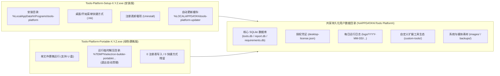
```mermaid
flowchart LR
    subgraph SetupVer["Tools-Platform-Setup-X.Y.Z.exe (安装版)"]
        S1["安装目录:<br/>%LocalAppData%\Programs\tools-platform"]
        S2["桌面/开始菜单快捷方式 (.lnk)"]
        S3["注册表卸载项 (Uninstall)"]
        S4["自动更新缓存:<br/>%LOCALAPPDATA%\tools-platform-updater"]
    end

    subgraph PortableVer["Tools-Platform-Portable-X.Y.Z.exe (绿色便携版)"]
        P1["单文件便携运行 (支持 U 盘)"]
        P2["运行临时解压目录:<br/>%TEMP%\electron-builder-portable\...<br/>(退出自动清理)"]
        P3["0 注册表写入 / 0 快捷方式残留"]
    end

    subgraph SharedData["共享持久化用户数据目录 (%APPDATA%\Tools Platform\)"]
        D1["核心 SQLite 数据库<br/>(tools.db / report.db / requirements.db)"]
        D2["授权凭证 (desktop-license.json)"]
        D3["每日运行日志 (logs/YYYY-MM-DD/...)"]
        D4["自定义扩展工具生态 (custom-tools/)"]
        D5["系统与媒体素材 (images/ / backups/)"]
    end

    SetupVer --> SharedData
    PortableVer --> SharedData
```

#### 12.4.2 客户端安装与执行层目录 (Program & Temp Files)

| 适用版本 | 默认物理路径 | 生成文件清单 | 作用与生命周期说明 |
| :--- | :--- | :--- | :--- |
| **安装版 (Setup)** | `%LocalAppData%\Programs\tools-platform\`<br/>*(自定义安装则为用户指定路径)* | • `Tools Platform.exe`<br/>• `Uninstall Tools Platform.exe`<br/>• `resources\app.asar`<br/>• `resources\elevate.exe`<br/>• 核心运行依赖库 (`ffmpeg.dll`, `d3dcompiler_47.dll`, `v8_context_snapshot.bin`, `locales\*.pak` 等) | **程序主程序与运行依赖库**。<br/>包含全部前后端源码（打包于 asar）、Node.js 与 Chromium 核心执行环境。运行卸载程序或覆盖安装时更新。 |
| **安装版 (Setup)** | `%USERPROFILE%\Desktop\`<br/>`%APPDATA%\Microsoft\Windows\Start Menu\Programs\` | • `Tools Platform.lnk` | **桌面与开始菜单快捷方式**。<br/>便于用户快速启动托盘客户端，卸载时自动移除。 |
| **安装版 (Setup)** | `HKCU\Software\Microsoft\Windows\CurrentVersion\Uninstall\com.toolsplatform.app` | • 注册表项（DisplayName, DisplayVersion, UninstallString 等） | **控制面板卸载注册项**。<br/>让应用正常展示在 Windows“设置 $\rightarrow$ 应用 $\rightarrow$ 已安装的应用”中。 |
| **安装版 (Setup)** | `%LOCALAPPDATA%\tools-platform-updater\` | • `latest.yml`<br/>• `*.blockmap`<br/>• `Tools-Platform-Setup-*.exe` | **自动更新增量下载缓存**。<br/>应用内后台检测到新版本时，按差量 Blockmap 仅拉取变更块，升级安装完成后自动清理。 |
| **绿色版 (Portable)** | `%TEMP%\electron-builder-portable\tools-platform-*\`<br/>*(或 `%LOCALAPPDATA%\Temp\...`)* | • 临时解包的 EXE 运行载荷与 asar 资源 | **绿色版临时自解压运行目录**。<br/>启动时解压运行依赖，**客户端退出时自动清理**，不污染主机。 |

#### 12.4.3 持久化用户数据目录 (%APPDATA%\Tools Platform\)

> [!IMPORTANT]
> **无论使用安装版还是绿色版，所有业务数据、配置、授权凭证均统一持久化存储于当前用户的 `%APPDATA%\Tools Platform\` 目录下**。
> 这意味着在安装版与绿色版之间互相切换、或直接下载新版 Portable.exe 替换旧版时，**所有业务数据均 100% 自动继承且绝对不会丢失**。

##### 用户数据目录完整拓扑结构：
```text
%APPDATA%\Tools Platform\ (即 C:\Users\<Username>\AppData\Roaming\Tools Platform\)
├── desktop-license.json                 # [授权] 客户端本地离线激活状态与硬件签名凭证
├── desktop-license-public-status.json   # [授权] 授权只读状态镜像 (供前端安全调用展示)
├── launch-state.json                    # [运行] 启动时间戳、窗口坐标与上次状态缓存
├── tools-platform-runtime-monitor.ps1   # [监控] Windows 原生托盘状态探针 PowerShell 脚本
├── logs\                                # [日志] 系统运行日志与运行时进程监控
│   ├── YYYY-MM-DD\                      #       按日期分目录归档
│   │   ├── out.log                      #       标准输出日志 (后端启动流水、API 访问日志)
│   │   └── error.log                    #       异常报错日志 (崩溃堆栈、异常捕获、网络超时)
│   ├── runtime-status.json              #       实时运行时快照 (PID、端口 3030、内存驻留、心跳)
│   └── runtime-command.json             #       托盘控制与主服务双向 IPC 调度通信文件
├── data\                                # [核心数据] 平台核心数据目录 (TOOLS_DATA_DIR)
│   ├── tools.db                         # [SQLite] 全局账号/租户控制面 + 默认租户原有业务库
│   ├── report.db                        # [SQLite] 报表与月报库 (SLA 快照、指标明细、健康度计分)
│   ├── requirements.db                  # [SQLite] 需求广场库 (专项治理协作需求与工单流转)
│   ├── ai-knowledge.db                  # [SQLite] AI 知识图谱向量库 (本地问答切片与检索索引)
│   ├── *.db-wal / *.db-shm              # [SQLite] WAL 模式高并发读写临时预写日志与索引
│   ├── custom-tools\                    # [生态] 自定义工具目录 (每个微工具的 HTML/JS/manifest/.i18n)
│   ├── builtin-tools-sync-decisions.json# [生态] 内置工具升级冲突判定记录 (保护本地修改)
│   ├── backups\                         # [备份] 升级安全备份与数据库全量快照
│   │   └── builtin-tools\               #       内置工具官方升级前的自动镜像归档 (支持一键回滚)
│   ├── images\                          # [素材] 胶片 PPT 切图、报表配图、知识库附件图片
│   ├── tmp\                             # [暂存] 临时中转目录 (解压、大文件上传、UIV 抓取中间数据)
│   └── tenants\                         # [租户] 新租户独立业务空间（默认租户不搬迁）
│       └── <tenant-id>\                 #       每个租户独立的 DB、附件、脚本和工具目录
│           ├── tools.db / report.db / requirements.db / ai-knowledge.db
│           ├── custom-tools\ / images\ / slide-library\
│           └── backups\ / tmp\
└── Cache\ / Code Cache\ / Local Storage # [引擎缓存] Chromium 渲染引擎与离线本地前端状态缓存
```

##### 核心业务文件功能字典：

| 文件 / 目录路径 | 文件类型 | 存储内容与核心功能 | 丢失或误删影响 |
| :--- | :--- | :--- | :--- |
| `desktop-license.json` | JSON | 存储客户端激活码（`DSKL1-` 开头）、机器指纹 Hash、签名认证及离线授权有效期。 | 需在下次启动时重新输入授权码激活。 |
| `desktop-license-public-status.json` | JSON | 授权脱敏公开状态（有效期、授权状态、租户名），供前端安全展示。 | 重启后由主进程自动重新生成。 |
| `launch-state.json` | JSON | 记录上次启动时间、端口分配、窗口尺寸与位置缓存。 | 重启后由程序重新生成默认窗口位置。 |
| `logs/YYYY-MM-DD/out.log` / `error.log` | Log 文本 | 记录本地后台运行流水与异常报错堆栈，支持托盘右键一键打开分析。 | 无影响，日志按日自动归档。 |
| `logs/runtime-status.json` | JSON | 实时运行时快照（进程 PID、本地服务端口 3030、心跳状态）。 | 由主进程定时刷新写入。 |
| `data/tools.db` | SQLite 数据库 | **全局控制面及默认租户兼容库**。账号、Session、租户清单保存在这里；升级前已有的导航、AI 配置、脚本、SLA 规则和自定义工具注册表继续作为默认租户数据原地使用。 | **极高**。丢失将影响登录、租户清单及默认租户业务。 |
| `data/chat-history.db` / `data/tenants/<tenant-id>/chat-history.db` | SQLite 数据库 | 租户共享的 TXT 聊天消息、全文索引、人员统计及用户个人状态。 | 丢失将需重新导入 TXT；该库不进入平台全局备份。 |
| `data/tenants/<tenant-id>/` | 独立租户目录 | 新租户的 `tools.db`、`report.db`、`requirements.db`、`ai-knowledge.db`、附件、自定义工具、备份和临时文件；目录之间不共享业务数据。 | 仅影响对应租户；归档租户时目录会保留。 |
| `data/report.db` | SQLite 数据库 | **报表看板与月报分析库**。包含历史月度快照、指标合控计算结果、各维度健康度计分、短板排名明细。 | **极高**。丢失将失去所有历史月报与数据看板记录。 |
| `data/requirements.db` | SQLite 数据库 | **需求广场流转库**。包含专项治理需求提单、流转进度与反馈工单。 | **高**。丢失将清空需求广场数据。 |
| `data/custom-tools/` | 文件夹 | 存放用户自行开发或导入的自定义小工具全部静态源码与多语言字典。 | 丢失将无法打开自建的扩展微工具。 |
| `data/backups/builtin-tools/` | 文件夹 | 每次内置工具随版本升级前自动创建的安全备份副本。 | 无影响，仅在需要回滚旧版内置工具时使用。 |
| `data/images/` | 图片媒体文件 | 胶片设计素材库切图、PPT 页面图片、报表生成的缩略图与图表资产。 | 相关 PPT 素材与图片无法正常展示预览。 |

#### 12.4.4 用户主动导出文件目录 (Downloads)

- **默认导出路径**：`%USERPROFILE%\Downloads\`（即 Windows 系统的“下载”文件夹）。
- **常见导出文件**：
  - `月度运营报告_YYYY-MM.xlsx`：月报分析导出的多维度 Excel 表格。
  - `SLA_催办提醒_*.html` / `*.txt`：一键催办生成的结构化邮件/即时通信模版。
  - `tools-platform-backup-*.zip`：在“存储与备份”中导出的全局全量数据备份包。
  - `custom-tool-*.zip`：在“自定义工具”中导出的独立微工具包。

#### 12.4.5 客户端数据清理、迁移与出厂重置指引

| 运维场景 | 推荐操作步骤 | 预期结果与注意事项 |
| :--- | :--- | :--- |
| **仅卸载主程序 (保留业务数据)** | 通过 Windows“设置 $\rightarrow$ 应用 $\rightarrow$ 卸载”运行卸载向导，或直接删除 Portable.exe。 | 仅清理安装目录和快捷方式，`%APPDATA%\Tools Platform` 完整保留，后续重装可直接复用全部数据。 |
| **全量迁移至新电脑** | 1. 退出旧电脑的 Tools Platform。<br/>2. 复制旧电脑的 `%APPDATA%\Tools Platform\data\` 文件夹到新电脑的对应路径。<br/>3. 在新电脑安装启动客户端并输入授权码。 | 新电脑无缝恢复所有配置、账号、历史月报、自定义工具与媒体素材。 |
| **彻底清除数据 / 恢复出厂设置** | 1. 退出托盘客户端进程。<br/>2. 直接删除整个 `%APPDATA%\Tools Platform\` 文件夹。 | 清除所有本地数据与授权状态，下次启动时将进入全新首次初始化与激活向导。 |

---

### 12.5 新手入门：安装登录后需要做啥 (Day 1 Checklist)

首次完成部署或安装并登录系统后，推荐按照以下顺序完成初始化配置：

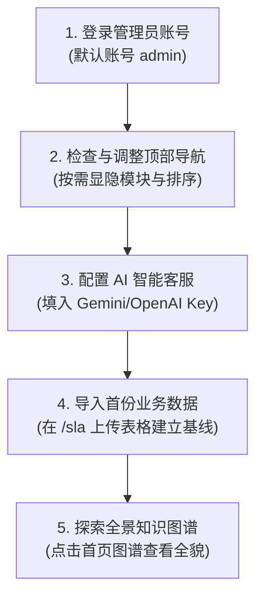
```mermaid
flowchart TD
    STEP1["1. 登录管理员账号<br/>(默认账号 admin)"] --> STEP2["2. 检查与调整顶部导航<br/>(按需显隐模块与排序)"]
    STEP2 --> STEP3["3. 配置 AI 智能客服<br/>(填入 Gemini/OpenAI Key)"]
    STEP3 --> STEP4["4. 导入首份业务数据<br/>(在 /sla 上传表格建立基线)"]
    STEP4 --> STEP5["5. 探索全景知识图谱<br/>(点击首页图谱查看全貌)"]
```

1. **第一步：登录账号**
   - 打开 `http://localhost:3030/login.html`。
   - 输入管理员账号登录（默认账号密码或联系运维管理员获取），登录后建议立即在“账号管理”中修改密码。
2. **第二步：配置顶部导航与分类 (`/api/nav-settings`)**
   - 点击右上角设置菜单中的“全局设置” $\rightarrow$ “顶部导航配置”。
   - 根据团队实际业务需求，调整常用工具的显隐状态、排序权重以及“更多工具”下拉分类。
3. **第三步：激活 AI 智能客服 (`/api/ai-settings`)**
   - 在“全局设置” $\rightarrow$ “AI 助手配置”中，选择模型提供商（推荐 Google Gemini 或 OpenAI 兼容模型）。
   - 填入对应 API Token 并保存，即可在右下角开启具备上下文感知的智能客服助理与只读报表分析。
4. **第四步：导入首份 SLA 数据并生成快照 (`/sla`)**
   - 进入“数据导入”页，拖入当月的多表数据（如风险表、整改表或工单表）。
   - 核对指标映射与达标阈值，点击“一键入库”，沉淀首份历史快照。
   - 前往“报表看板” (`/report`) 与“月报页面” (`/monthly`) 查阅自动生成的健康度排名与短板透视矩阵。
5. **第五步：体验 2D/3D 知识图谱**
   - 点击首页 Hero 区域的“项目知识图谱”按钮，探索平台模块拓扑、源码链路与指标体系。

---

## 13. CI/CD 自动化发布与客户端平滑升级机制

平台配置了工业级 **GitHub Actions 自动化流水线**，实现了“主分支代码推送 -> 自动打标/语义化升级 -> Windows 双版本交叉编译 -> 发布 GitHub Releases -> 客户端差量增量更新”的闭环发布生命周期：

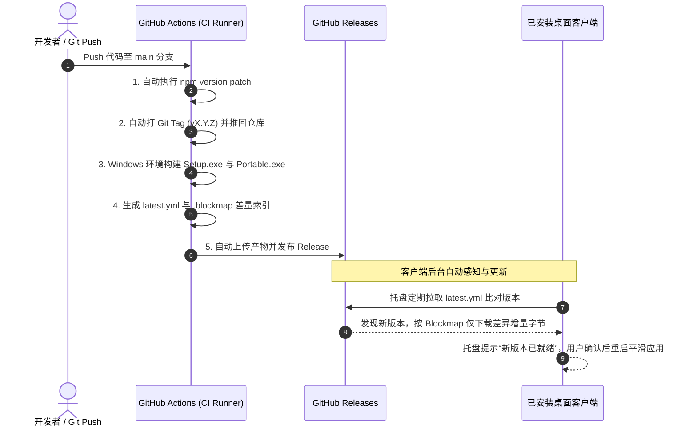
```mermaid
sequenceDiagram
    autonumber
    actor Dev as 开发者 / Git Push
    participant CI as GitHub Actions (CI Runner)
    participant GH as GitHub Releases
    participant Client as 已安装桌面客户端

    Dev->>CI: Push 代码至 main 分支
    CI->>CI: 1. 自动执行 npm version patch
    CI->>CI: 2. 自动打 Git Tag (vX.Y.Z) 并推回仓库
    CI->>CI: 3. Windows 环境构建 Setup.exe 与 Portable.exe
    CI->>CI: 4. 生成 latest.yml 与 .blockmap 差量索引
    CI->>GH: 5. 自动上传产物并发布 Release
    Note over Client,GH: 客户端后台自动感知与更新
    Client->>GH: 托盘定期拉取 latest.yml 比对版本
    GH-->>Client: 发现新版本，按 Blockmap 仅下载差异增量字节
    Client-->>Client: 托盘提示“新版本已就绪”，用户确认后重启平滑应用
```

### 13.1 语义化版本与自动化 Release 流水线 (`.github/workflows/build.yml`)
1. **自动 Patch 版本递增**：
   - 开发者向 `main` 分支提交代码后，CI 流水线第一阶段 (`prepare-release`) 自动在 `tools-platform/package.json` 中自增 patch 版本号。
   - 自动提交 `chore: release vX.Y.Z [skip ci]` 并打上对应 `vX.Y.Z` 的 Git Tag，随后推回 GitHub 仓库。
2. **多版本自动交叉编译**：
   - 第二阶段 (`build`) 在 `windows-latest` 环境下拉取最新 Tag。
   - 执行 `npm run build:win`，同时构建 NSIS 安装包 (`Setup.exe`) 与绿色免安装单文件 (`Portable.exe`)。
3. **Release 资产自动归档**：
   - 自动生成 NSIS 升级所需的 `latest.yml` 校验清单与 `.blockmap` 文件。
   - 通过 `softprops/action-gh-release` 自动将双版本 `.exe` 及升级资产发布至 GitHub Releases。

### 13.2 客户端平滑增量更新机制 (Electron-Updater)
1. **Blockmap 差量增量下载**：
   - 安装版客户端内置 `electron-updater`，启动时或托盘右键手动“检查更新”时，自动向 GitHub Releases 拉取 `latest.yml`。
   - 比对本地版本号与远程版本号；若发现新版本，利用 `.blockmap` 索引仅下载变动的二进制 Block 数据，**节省 80%+ 的网络流量消耗**。
2. **托盘日志与进度可视化**：
   - 下载进度实时推送到 Windows 托盘与原生的 WinForms 进度监控窗口。
   - 下载完成后弹出“重启安装新版本”提示，用户点击后自动退出、平滑覆盖并重启恢复服务。

---

## 14. 开发约定与排障 FAQ

### 开发约定规范
1. **轻量静态原则**：前端保持原生 HTML/JS/CSS 架构，严禁随意引入庞大且不必要的重型前端打包构建链。
2. **SQLite 规范**：新增任何业务模型一律优先设计 SQLite 数据表并编写自愈脚本，严禁新增裸 JSON 文件读写。
3. **版本防缓存机制**：修改 `frontend/js/` 或 `frontend/css/` 中的静态文件后，必须在引用该文件的 HTML 页面中同步递增版本戳（如 `navbar.js?v=1.0.176`）。
4. **安全与脱敏原则**：所有包含密码、Token、Secret、Cookie、私钥的请求与响应体必须经过统一脱敏拦截器过滤后再打印到日志或投递到 AI 模型。

### 排障 FAQ
- **Q: 启动报端口已被占用 (`EADDRINUSE`)？**
  - A: 指定新端口启动即可：`PORT=3031 npm start`（PowerShell: `$env:PORT=3031; npm start`）。
- **Q: 数据库出现死锁或损坏提示？**
  - A: 服务在 `server.js` 启动时已集成 `repairStartupDatabases()` 自动检测与修复，可在 `backend/data/backups/` 中查看自动修复前后的 `.db` 副本。
- **Q: Windows 安装版无法启动本地服务？**
  - A: 右键托盘图标打开“查看实时日志/更新进度”，检查系统用户数据目录下的 `logs/YYYY-MM-DD/error.log`。
- **Q: 绿色版与安装版如何共存或迁移？**
  - A: 两者数据均存储在当前用户的 `%APPDATA%/tools-platform/data` 目录下，直接关闭旧版本运行新版本 EXE 即可，数据完全无缝继承。
